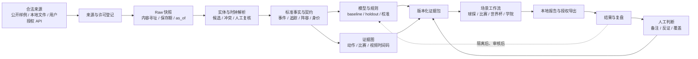

# 2026 足球工具版图与 ScoutFootball 长期研究方向

> 调研快照：2026-07-16；定位修订：2026-07-17。本文用于回答“行业已有何物、仍缺什么、ScoutFootball 应该长期研究和建设什么”。厂商能力以官方产品页的公开表述为准；跨产品比较、缺陷归纳和战略判断是本项目的分析，不是厂商自述。第三方工具或数据在个人使用前仍需核验地区、赛事、授权、API、价格和数据处理条款。
>
> 项目属性以 [`PROJECT_CHARTER.md`](PROJECT_CHARTER.md) 为准：ScoutFootball 是本地优先、MIT 开放源代码、个人维护、非盈利项目。本文比较商业工具是为了学习功能、标准和缺陷，不构成商业化、定价、获客、企业部署或市场进入计划。

## Executive Summary

- 足球工具并不缺：数据、视频、追踪、球探、转会、战术、可穿戴、医疗和俱乐部运营各自已有成熟产品。对本项目有意义的工作假设是：个人仍可受益于一条能跨来源、跨模型、跨时间复核的“证据到决策”链；该假设应由维护者真实任务和自愿社区测试验证。
- 头部厂商的优势可能主要来自数据权利、采集网络、摄像硬件、俱乐部网络和服务交付。ScoutFootball 不复制这些重资产能力，也不与其竞争客户，而是复用开放标准和个人合法输入，建设本地、可审计的研究工作台。
- 开发主线应从“继续增加页面和指标”转为三个个人闭环：球探决策、比赛准备、数据与模型研究。世界杯是第一个高密度参考场景，不是项目永久的全部身份。
- 开发顺序先确认个人工作流和数据权利，再修复数据可读性、来源/许可/快照、身份、契约、真实浏览器 E2E 和发布 fail-closed；空间、视频、离球和多模态研究必须等待合规数据、同步质量、基线与模型卡。顺序只由门槛决定，不绑定日历期限。
- 最远方向不是“预测一切”，而是建立可移植的足球证据协议、开放适配层和人机共同决策记录，使个人分析者、学习者和研究者能够在自己的设备上获得诚实、可控、可复现的分析基础。

## 1. 调研问题、范围与证据等级

本次调研围绕五个问题：

1. 当前足球行业工具覆盖了哪些工作？
2. 商业产品、开源项目和学术原型分别擅长什么？
3. 用户仍在哪些地方需要手工拼接、重复核验或承担不可见风险？
4. ScoutFootball 已经具备哪些可复用基础，又有哪些文档和工程债？
5. 哪条路线既有长期研究价值，又能由个人持续理解、运行和维护？

证据按强度分为三层：

| 等级 | 含义 | 本文用法 |
| --- | --- | --- |
| A | 官方产品页、标准组织、论文、官方开源仓库、代码和本地产物 | 支撑“存在什么”和本地事实 |
| B | 多个 A 级来源的横向综合 | 支撑市场结构和共同缺口 |
| C | 战略推演 | 支撑产品取舍和远期方向，必须标为判断或假设 |

本次没有进行完整产品试用、独立质量测试，也没有获得完整 API 文档和所有许可条款。因此本文不能判断真实数据质量、个人总体使用成本或某家厂商在特定联赛的实际覆盖；个人接入前必须另行核验。

## 2. 2026 足球工具市场地图

### 2.1 数据、视频、追踪与情报

| 类别 | 代表工具 | 官方定位所覆盖的工作 | 对 ScoutFootball 的启示 |
| --- | --- | --- | --- |
| 事件数据与视频库 | [Hudl Wyscout](https://www.hudl.com/products/wyscout)、[StatsBomb](https://statsbomb.com/what-we-do/)、[Opta](https://www.statsperform.com/opta/) | 比赛视频、事件数据、搜索、报告、对手与球员分析 | 数据规模和版权不是本项目可复制的护城河；重点应放在授权数据进入后的可追溯使用 |
| 上下文事件数据 | [StatsBomb 360](https://statsbomb.com/what-we-do/soccer-data/360-2/) | 在事件时刻补充可见球员位置，为压力、空间和离球分析增加上下文 | 360 不等于连续追踪；产品必须保留采样机制和不可见边界 |
| 广播级追踪 | [SkillCorner](https://skillcorner.com/sports/football)、[Opta Vision](https://www.statsperform.com/opta-vision/)、[IMPECT](https://www.impect.com/en/products/) | 从视频提取球员/球追踪、身体或空间指标，并与事件结合 | 追踪点本身不是决策；同步、身份、缺失和不确定性才是接入难点 |
| 自动采集与分析 | [Veo](https://www.veo.com/en-us/sport/soccer)、[Pixellot](https://www.pixellot.tv/sports/soccer/)、[Spiideo](https://www.spiideo.com/soccer-football-video-analysis-software/) | 自动拍摄、直播、剪辑和部分自动标记 | 不自研相机；设计可接收合规视频、时间码和事件标记的接口 |
| 专业视频工作流 | [Hudl Sportscode](https://www.hudl.com/products/sportscode)、[Nacsport](https://www.nacsport.com/)、[Metrica Play](https://www.metrica-sports.com/metrica-playbase) | 编码、标签、播放列表、演示、协作和教练交付 | ScoutFootball 应输出可回到原视频的证据引用，而不是另造完整视频资产系统 |
| 球探与招募智能 | [SciSports](https://www.scisports.com/scouting/)、[Driblab](https://www.driblab.com/products)、[Wyscout Scouting](https://www.hudl.com/products/wyscout/scouting-area)、[Opta Pro Hub](https://www.statsperform.com/products/opta-pro-hub/) | 球员搜索、相似度、角色匹配、名单和报告 | “排序”已商品化；差异化应是为什么入选、证据边界、人工复核和决策后果 |
| 转会网络与市场 | [TransferRoom](https://www.transferroom.com/) | 俱乐部、经纪人与球员之间的转会网络、需求和沟通 | 网络效应无法靠功能列表复制；ScoutFootball 只做准备材料和授权导出，不做交易市场 |
| 数据编排与展示 | [Twenty3 Toolbox](https://www.twenty3.sport/toolbox) | 聚合数据、分析、可视化、报告和内容工作流 | “连接器 + 可复用报告”是可借鉴的产品结构，但语义和来源不能在聚合中丢失 |

### 2.2 教练、体能、医疗与俱乐部运营

| 类别 | 代表工具 | 官方定位所覆盖的工作 | 与本项目关系 |
| --- | --- | --- | --- |
| 战术与训练设计 | [TacticalPad](https://www.tacticalpad.com/new/index.php)、[The Coaching Manual](https://www.thecoachingmanual.com/) | 战术动画、训练设计、教练知识和计划 | 保留轻量战术交付，但不把内容课程平台作为核心 |
| 可穿戴与负荷 | [Catapult](https://www.catapult.com/)、[STATSports](https://statsports.com/)、[Playermaker](https://www.playermaker.com/) | GPS/惯性数据、负荷、体能和表现监控 | 健康和负荷是高敏感数据；近期只定义授权导入边界，不做伤病诊断 |
| 医疗与运动员管理 | [Kitman Labs](https://www.kitmanlabs.com/gb/sports-management-software/global-football/)、[Teamworks AMS](https://teamworks.com/ams/)、[SAP Sports One](https://www.sap.com/products/data-cloud/sports-one.html) | 医疗、训练、人员、日程和跨部门数据 | 不建设 EMR；若未来做可用性信号，必须最小化数据并经过权限、审计和删除设计 |
| 学院与俱乐部运营 | [ProSoccerData](https://www.prosoccerdata.com/professional/)、[360Player](https://www.360player.com/)、[SoccerLAB](https://www.soccerlab.com/) | 球员发展、日程、沟通、文档和学院管理 | 作为邻接领域理解，不把个人项目扩张成俱乐部 ERP 或组织服务 |
| 草根试训与发现 | [aiScout](https://www.ai.io/aiscout) | 移动端标准化试训、球员发现和数据画像 | 展示了低成本采样的需求，也提醒项目必须处理设备偏差、可比性和未成年人治理 |

### 2.3 真正的日常替代栈

对个人使用而言，ScoutFootball 更直接的替代方式不是企业足球平台，而是被人工拼接的通用工具。下表是需要在维护者真实任务中验证的设计假设，不讨论市场份额：

| 工作 | 常见替代工具 | 为什么难被新工具替换 | ScoutFootball 应怎样兼容 |
| --- | --- | --- | --- |
| 名单、打分、预算和备注 | [Excel](https://www.microsoft.com/microsoft-365/excel)、[Google Sheets](https://workspace.google.com/products/sheets/) | 灵活、熟悉、可快速分享，组织已有模板 | 安全 CSV/Excel 导入导出、保留公式注入防护和字段映射预览 |
| 仪表盘与汇报 | [Power BI](https://www.microsoft.com/en-us/power-platform/products/power-bi)、[Tableau](https://www.tableau.com/) | 管理层熟悉，能接企业数据和权限体系 | 输出有版本的证据表/语义层，不企图替代所有 BI |
| 视频观看与手工编码 | [VLC](https://www.videolan.org/vlc/)、[LongoMatch](https://longomatch.com/en/about-us/)、文件夹和播放列表 | 本地视频直接、成本低、操作自由 | 先接时间码、XML/CSV 和本地路径，不先建设视频资产平台 |
| 研究和一次性分析 | Jupyter、Python/R 脚本、SQL | 分析师可完全控制，适合探索 | 提供可导出的快照、SDK 和 notebook，而不是封闭算法黑箱 |
| 沟通与签核 | 邮件、聊天、PDF、演示文稿 | 所有人都能打开，符合现有组织习惯 | 证据包生成不同粒度摘要，保留决策版本和回链 |
| 任务与知识 | 通用文档、看板和共享盘 | 已承载俱乐部大量非分析工作 | 只管理足球证据状态，通过链接/导出集成，不复制通用项目管理 |

因此，个人工作流是否值得保留的关键不是“功能比某一足球平台多”，而是在不抛弃现有表格、视频和报告习惯的前提下，增加可追溯性和复现能力。

### 2.4 邻接足球技术领域

| 邻接域 | 代表工具 | 为什么纳入版图 | ScoutFootball 边界 |
| --- | --- | --- | --- |
| 裁判与判罚技术 | [Hawk-Eye](https://www.hawkeyeinnovations.com/)、[Genius Sports Perform](https://www.geniussports.com/perform/) | VAR、门线、半自动越位和判罚数据属于完整足球技术生态 | 不做实时判罚；只在合法获得时把判罚事件作为比赛上下文 |
| 赛事与会员运营 | [Genius Sports league software](https://www.geniussports.com/perform/)、[TeamSnap](https://www.teamsnap.com/) | 赛程、报名、名单、会员、沟通和场地是赛事运行基础 | 不复制竞赛/会员 ERP；接入官方赛程和稳定实体 ID |
| 票务与比赛日 | [Ticketmaster Business](https://business.ticketmaster.com/soccer/) | 票务、入场、场馆和球迷账户构成俱乐部商业基础设施 | 不做票务或球迷画像；避免把竞技分析扩张成 CRM |
| 球迷互动与忠诚 | [Monterosa](https://monterosa.co/solutions/sports-fan-engagement) | 投票、预测、互动内容和第一方数据服务于球迷经营 | 与内部决策产品分离，不把球迷游戏反馈当竞技真值 |
| 媒体资产与分发 | [Greenfly](https://www.greenfly.com/sports/teams/) | 图片/短视频采集、编排、球员分发和赞助内容是另一条工作流 | 不建设媒体 DAM；只处理有权使用的分析证据引用 |
| 官方数据与赛事诚信 | [Genius Sports](https://www.geniussports.com/) | 官方采集、分发、完整性和反操纵服务影响数据权利与可信度 | 不做博彩监控；在来源登记中保留官方/非官方性质 |

这些领域说明“足球操作系统”边界极宽。ScoutFootball 必须保持竞技证据和决策层定位，避免因追求 all-in-one 进入强网络效应、强合规或强硬件领域。

### 2.5 市场结构工作假设

以下是对官方公开能力的综合判断和待验证假设，不是独立质量测试证明的事实，也不是对单一厂商的指控：

- 市场是“多个强单点 + 少数大套件”，而不是一个统一足球操作系统。
- 大型俱乐部能用采购和分析团队吸收集成成本；小型俱乐部、学院和独立研究者更容易在价格、技能和数据权利之间被夹住。
- 供应商常以 API、CSV、XML 或视频导出支持互通，但文件可交换不代表实体、时间、指标和许可语义一致。
- 当前厂商公开定位普遍强调上下文、速度、工作流、自动化和组织采用，而不只强调“有无数据”。可信度、可回溯性和跨来源复核是否真正改善个人工作流，需要在 G0-A 的真实任务中验证。

## 3. 开源、开放数据与研究基础

### 3.1 可以复用的地基

| 层 | 资源 | 可复用价值 | 必须保留的限制 |
| --- | --- | --- | --- |
| 事件样例 | [StatsBomb Open Data](https://github.com/statsbomb/open-data) | 带官方说明和署名要求的事件数据，可用于可复现基线 | 只是公开子集；公开许可不代表全赛事或商业数据权利 |
| 广播追踪样例 | [SkillCorner Open Data](https://github.com/SkillCorner/opendata) | 事件与 10 Hz 追踪样例，适合研究同步、身份和离球指标 | 只有少量比赛；存在画面外推断、身份和滤波问题 |
| 追踪样例 | [Metrica Sports Sample Data](https://github.com/metrica-sports/sample-data) | 匿名事件、追踪和视频样例 | 比赛数量很小，不能证明跨联赛泛化 |
| 标准化 | [kloppy](https://github.com/PySport/kloppy) | 多供应商事件/追踪解析和统一接口 | 标准化不能抹平供应商原始语义，仍需保存 raw 字段和转换报告 |
| 动作价值 | [socceraction](https://github.com/ML-KULeuven/socceraction) | SPADL、xT、VAEP 等可复现基线 | 仓库维护状态和数据适配要单独评估；模型输出不是球员“真实能力” |
| 公共格式 | [Common Data Format](https://www.cdf.football/)、[FIFA EPTS 标准](https://inside.fifa.com/innovation/standards/epts/research-development-epts-standard-data-format) | 事件/追踪交换和供应商对齐参考 | 标准覆盖不等于质量一致；需要转换损失与版本登记 |
| 时钟同步 | [ETSY](https://dtai.cs.kuleuven.be/sports/blog/etsy%3A-a-rule-based-approach-to-event-and-tracking-data-synchronization/) | 事件与追踪同步的规则基线和质量思路 | 每场比赛都应输出同步残差和失败段，不应只给“已同步”布尔值 |
| 视觉与基准 | [SoccerNet](https://github.com/SoccerNet)、[SoccerTrack v2](https://atomscott.github.io/SoccerTrack-v2/) | 游戏状态、视觉理解、多目标追踪研究任务 | 视频权利、标注域、摄像视角和算力会限制产品化 |
| 战术研究 | [TacticAI](https://www.nature.com/articles/s41467-024-45965-x) | 展示图模型与人类专家共同评估定位球建议的研究范式 | 单一场景研究不能直接外推为通用比赛决策系统 |
| 身份证据 | [Reep Football](https://reep.football/) | 历史球员和比赛资料可作人工核验线索 | 只能作为证据来源之一，不能绕过明确的主键和冲突复核 |

### 3.2 开源生态的共同缺口

1. **开放不等于同一许可。** 代码、事件、追踪、视频和派生产物往往拥有不同权利。
2. **样例不等于覆盖。** 很多数据集只有数场比赛、匿名球员或旧赛季，适合验证算法，不足以支撑运营结论。
3. **统一格式会损失语义。** 压力、接球、控球、身体部位、可见区域和身份置信度在供应商间并不等价。
4. **身份与时间仍是基础难题。** 同名、改名、转会、赛季边界、比赛时钟和视频时钟错误会污染所有后续模型。
5. **论文复现不等于产品。** 缺少持续维护、失败恢复、低覆盖状态、解释、报告和真实用户工作流。
6. **不确定性常被压平。** 画面外位置、插值、弱标签、模型校准和域外样本常被一个分数掩盖。
7. **强模型容易超过证据。** Transformer、GNN、强化学习或多模态模型如果没有强基线、时间外验证和错误案例，只会增加不可审计复杂度。

这正是 ScoutFootball 可以积累的长期资产：不是再写一个算法实现，而是把授权、原始语义、转换、覆盖、身份、不确定性、模型版本和人工判断连成一个可复核对象。

## 4. 同类项目和现有工具的待验证缺口

以下缺口是由公开产品边界、开源项目限制和本地经验归纳的研究假设。它们不一定适用于每家厂商或每个使用者，必须用个人任务测试、公开资料和可复现实验继续验证。

### 4.1 数据层

- **来源被仪表盘隐藏。** 用户看到的是统一排名，但不清楚哪些字段来自事件、赛季代理、人工输入、插值或模型。
- **时间真值不完整。** 现在可见的合同、身价或阵容很容易被误用来解释过去，形成时间泄漏。
- **实体解析过度自动化。** 模糊匹配的高覆盖率看起来漂亮，却可能静默合并同名球员或错误球队。
- **覆盖率只有总体值。** 总体 90% 不能说明目标联赛、位置、年龄、性别或单个球员是否可用。
- **许可不能随派生产物流动。** 导出图表和报告经常与原始来源、署名和再分发条件脱节。

### 4.2 模型层

- **专有总分难以复核。** 不同平台的“影响力”“潜力”“匹配度”没有共同定义。
- **相关性被写成因果。** 比赛事件、球队强弱和上场时间共同影响球员指标，单一相关模型无法证明球员带来的真实增量。
- **低样本极值被奖励。** per-90、射门转化、动作价值和追踪强度都可能在小样本下产生误导。
- **预测缺少行动边界。** 概率、排名或相似度常没有说明何时不应使用，也没有阈值、人工复核和回滚机制。
- **女子、青年和非广播比赛域偏移。** 使用成年男子顶级联赛训练的基线，不应直接套用到不同群体和采集条件。

### 4.3 工作流层

- **洞察与证据分离。** 排名、视频片段、教练笔记、合同约束和最终决定分散在不同工具。
- **“导出”代替了互操作。** PDF/CSV 可以发送，却无法保留筛选条件、数据快照、模型版本和反对意见。
- **决策后没有学习。** 很少系统化记录“当时为何推荐、谁覆盖了建议、后来发生什么、模型应如何调整”。
- **跨部门语言不同。** 球探、教练、数据、体能、医疗和管理层需要不同粒度，同一仪表盘不能自动形成共同决策。
- **个人使用门槛仍高。** 数据工程、许可证、配置、计算资源和持续维护可能超过个人能够承担的复杂度。

### 4.4 治理层

- 健康、位置、合同、未成年人和内部评价属于敏感数据，默认云同步会扩大泄露和滥用面。
- 自动生成的球员评价可能固化历史偏差，影响职业机会；系统必须允许申诉、解释和人工覆盖。
- 实时赔率或交易建议会把研究工具推向高风险用途，本项目明确不进入这类用途。

## 5. ScoutFootball 当前位置

本地代码和产物的详细核验见 [`CAPABILITIES.md`](CAPABILITIES.md)。这里只给战略视角。

### 5.1 已形成的资产

- Python 数据流水线、DuckDB/Parquet 本地层、FastAPI、静态前端和桌面包装形成了端到端雏形。
- 球员评分、比赛概率、动作价值、球探复核、战术板和世界杯赛前简报已经提供多个可组合部件。
- 来源署名、快照日期、低覆盖、`recorded/not_recorded`、模型运行和本地状态等诚实表达已经在部分流程中出现。
- 浏览器本地工作区、版本化导入导出和保守身份解析符合敏感足球决策的本地优先方向。

### 5.2 当前最危险的债务

- 能力增长快于结构治理：前端和 API 单体过大，顶层视图、路由、静态映射和文档口径产生漂移。
- 仓库里“已交付”“样例”“估算”“本地状态”“远期计划”仍会在不同文档混在一起。
- 静态快照、API、数据契约和实际产物缺少一个自动生成、可阻断发布的统一能力登记。
- CI 缺少真实浏览器关键流程；若发布流水线允许关键训练或构建失败后继续，发布物不能被当成可信结果。
- 局部 Parquet 元数据能被读取，但本次审计运行时无法完整解码部分文件；行数不能代替可用性验证。

### 5.3 项目条件

| 维度 | 判断 |
| --- | --- |
| 已有基础 | 本地优先、全栈可控、足球专用工作流已萌芽、愿意显式表达覆盖和来源、可快速试验 |
| 内部限制 | 数据版权和覆盖弱、单体复杂、文档漂移、缺少稳定个人工作流证据、发布/静态契约尚未形成强门槛 |
| 公共价值 | 个人研究者需要低成本可审计工具；供应商间互操作仍弱；世界杯可做高密度开放参考场景 |
| 项目风险 | 单人维护负担、许可变化、依赖和数据失效、研究范围膨胀、模型过度承诺会迅速损害可信度 |

## 6. 项目定位

### 6.1 一句话定位

**ScoutFootball 是本地优先、开放源代码、个人维护、非盈利、供应商中立且可审计的足球证据到决策工作台：把合法输入、模型、视频引用和人工判断封装成可复现、可质疑、可回滚的本地决策包。**

它不是 SaaS、商业版、企业部署、数据供应商、摄像机、转会市场、医疗记录系统、直播平台或博彩工具。

### 6.2 使用者范围

这是项目边界，不是客户分层：

1. **第一服务对象：** 维护者本人，以及具有相似需求的个人足球爱好者、独立分析者、业余教练、学生和研究学习者。
2. **开放复用：** 其他个人可以用于课程、非商业研究、公开方法复现和个人作品，也可以按 MIT License 修改或 fork。
3. **本地输入：** 使用者可以导入自己合法拥有或获准使用的文件和 API 数据；项目不附带、转售或集中收集这些数据。
4. **不承担：** 俱乐部或企业部署、运维、SLA、组织账号、医疗诊断、硬件采集、实时交易和云端多人工作区。

### 6.3 项目模块：一个核心，多个场景包

| 模块 | 长期职责 |
| --- | --- |
| ScoutFootball Core | 数据/许可/快照/身份/契约、证据图、模型登记、工作区、导出、插件 SDK、质量门槛 |
| World Cup Pack | 赛程、阵容快照、赛前简报、路径概率、战术计划和赛后复盘；作为参考实现 |
| Recruitment Pack | 需求简报、角色模型、长名单、对比、shortlist、决策档案和结果回灌 |
| Opposition & Match Pack | 对手模式、比赛证据、场景设计、战术板、赛后计划对照 |
| Academy Pack | 年龄段发展、样本公平性、训练目标和长期轨迹；必须先完成未成年人治理 |

世界杯场景带来明确时间、球队和比赛结构，适合展示完整闭环；核心协议和组件必须保持赛事无关，避免世界杯样例过时后项目研究范围失去方向。

## 7. 建设、集成与明确不做

### 7.1 必须自己建设的长期核心

- **Source & License Registry：** 每个输入的供应商、许可、用途、保存和再分发规则。
- **Snapshot & Lineage：** `as_of` 时间、输入 hash、转换版本、字段级来源、可复现命令，以及保存期结束或权利撤销后的可验证删除。
- **Identity Review Workspace：** 确定、候选、冲突、人工确认和撤销，不以模糊匹配覆盖率为目标。
- **Football Evidence Package：** 结论、证据、反证、覆盖、模型、人工意见和导出条件的版本化格式。
- **Contract Registry：** API、静态 JSON、导出和本地存储共用 schema 与兼容策略。
- **Model Governance：** baseline、时间外 holdout、校准、切片、误差案例、晋级、回滚和失效日期。
- **Workflow Engine：** 球探、比赛和模型发布三个闭环的步骤、状态、审阅和本地审计。
- **Provider Adapter SDK：** 显式授权的文件/API 连接器，保存原始语义和转换损失报告。

### 7.2 应复用或集成

- 用 SPADL/socceraction 做事件动作价值基线，不重新发明所有表示法。
- 用 kloppy、FIFA EPTS 和 Common Data Format 做格式对照与适配测试。
- 用 mplsoccer、Plotly/ECharts 做足球图表；用授权视频系统的时间码/XML/播放列表做回链。
- 使用公开数据只做可复现实验、测试和演示，个人实际分析范围由用户合法拥有的本地输入决定。
- 对 Wyscout、StatsBomb、Opta、SkillCorner 等商业数据只提供合法导入接口，不绕过访问控制或抓取限制。

### 7.3 明确不做或延后

- 不参与全球数据采集、反爬或版权竞赛。
- 不自研摄像机、可穿戴硬件或视频 CDN。
- 不建设转会撮合网络、经纪人 CRM 或俱乐部 ERP。
- 不存储医疗病历，不输出伤病诊断或“伤病必然性”分数。
- 不做实时博彩、赔率套利或自动交易产品。
- 不建设默认或可选的云端多人工作区、多租户 SaaS 或组织账号体系；协作通过本地文件、版本化导出和用户自行选择的外部工具完成。
- 没有合规数据、强基线和时间外验证前，不把 GNN、Transformer、强化学习或世界模型写成生产能力。

## 8. 三个黄金工作流

### 8.1 球探决策闭环

`需求简报 → 数据/覆盖检查 → 长名单 → 角色内比较 → shortlist → 证据档案 → 人工复核 → 决策 → 结果回灌`

关键要求：需求中的位置、角色、预算、年龄、联赛、风险和时间必须版本化；每个推荐能下钻到比赛/动作/视频时间码；反对意见与人工覆盖不能丢失；结果回灌必须与模型训练标签隔离。

### 8.2 比赛准备闭环

`赛程 → 输入快照 → 来源受限简报 → 对手模式 → 多场景假设 → 战术板 → 导出/沟通 → 赛后对照`

关键要求：预计名单不能写成官方名单；模型概率与球队新闻分开；战术建议标明是人工、规则还是模型生成；赛后记录计划是否执行及证据，而不是只看赛果。

### 8.3 数据与模型发布闭环

`授权输入 → 快照 → 质量检查 → 特征 → 训练 → holdout/切片 → 模型卡 → 候选比较 → 发布或拒绝 → 监控/回滚`

关键要求：任何关键检查失败都阻断发布；模型无法读取完整输入时不得使用元数据行数充当成功；同一切分下与简单 baseline 比较；产物必须可回到输入 hash 和代码版本。

## 9. 目标架构

架构原则：在允许保存的期间，raw 不被标准化结果就地覆盖，而以内容寻址版本保存；许可撤销、法定删除或保存期到期时执行可验证删除，并用不含原始内容的 tombstone 使下游产物失效。每次转换有版本和损失报告；证据包是核心交换对象；人类覆盖是正式状态，不是被模型吞掉的备注；结果反馈不能自动变成训练真值。

## 10. 长期建设与研究主题

| 计划 | 用户问题 | 具体建设内容 | 价值 | 前置门槛 |
| --- | --- | --- | --- | --- |
| Trust Kernel | “这条结论从哪来，能否重算？” | 来源/许可/快照登记、字段 lineage、证据包、契约注册 | 形成不可轻易复制的可信基础 | 先完成现有产物盘点 |
| Identity Desk | “这是不是同一个人/队/比赛？” | 候选证据、冲突矩阵、人工确认、撤销、覆盖切片 | 降低静默错配 | 稳定实体 schema |
| Decision Pack | “为什么推荐，谁同意，之后怎样？” | 需求、排名、证据、反证、结论、签核、结果的版本文件 | 把页面变成可复核决策 | 工作区迁移和导入安全 |
| Role & Style Lab | “他是否适合我们的角色和比赛方式？” | 角色本体、可编辑权重、相似球员、敏感性分析、样本边界 | 比通用总分更贴近招募 | 位置/角色标签与切片 baseline |
| Match Learning Loop | “计划是否被执行，哪些假设错了？” | 简报-战术板-事件/视频-赛后对照 | 让个人分析形成可重放研究记录 | 时间码、事件合同和人工复盘 |
| Adapter SDK | “如何接入已有供应商而不丢语义？” | 文件/API 插件、raw 保留、转换报告、许可策略 | 供应商中立与生态扩展 | contract registry 稳定 |
| Data Quality Observatory | “当前哪些数据或模型已不可用？” | 覆盖、陈旧度、schema drift、身份冲突、同步残差、SLO | 将失败变成可见状态 | 发布门禁和运行登记 |
| Spatial Lab | “离球跑动和空间贡献是什么？” | 追踪质量、控场、压迫、跑动、空间价值、反事实基线 | 长期技术差异化 | 授权 tracking、同步和域外验证 |
| Multimodal Evidence | “能否从视频找到支持或反驳？” | 人机协同标记、片段检索、事件对齐、视觉不确定性 | 降低证据查找成本 | 视频权利、算力预算、视觉基准 |
| Open Method Exchange | “个人和研究社区如何共享方法而不共享私有数据？” | 开放 schema、公共测试夹具、模型卡和可复现实验配方 | 促进非盈利共享与独立复现 | 仅使用公开或允许再分发的数据 |

### 10.1 开放发布与本地分发原则

- 核心代码、schema、文档和公开样例工作流保持开放，遵循仓库 MIT License；第三方数据仍遵循各自许可。
- 通过源码、可复现安装流程以及可选桌面或容器产物分发，核心功能应能在个人设备本地运行。
- 不设置付费层、订阅、open-core 功能切割、商业双许可证、SaaS、私有团队版、企业部署、咨询培训或付费连接器计划。
- 用户数据默认只在本地保存；不启用默认遥测、账号系统或远程上传。
- 第三方适配器只读取个人用户合法授权的本地输入，不附带、转售或再分发第三方数据。
- 项目通过清晰文档、自动测试、可复现发布和自愿社区贡献降低单人维护风险，而不是依赖收入或客户增长。

### 10.2 个人与社区验证

1. 用 World Cup Pack 提供一套来源清楚、可重放的公开参考案例，展示证据包而不是只展示预测。
2. 维护者先用自己的真实任务反复运行 Recruitment、Match 或模型研究流程，只继续维护确有重复价值的分支。
3. 个人分析师、学生、研究者和开源贡献者可以自愿运行相同本地任务脚本并主动提交不含敏感数据的反馈。
4. 测试不上传工作区、数据文件或内部评价；跨设备移动通过本地导入、导出和备份完成。
5. 公开失败案例、覆盖切片和模型卡，将其作为透明度与复现记录，而不是品牌或获客材料。

### 10.3 开放源码与研究协作

- **第三方数据：** 依据公开文档、开放标准和个人合法提供的导出文件实现适配，不以商业合作为前置条件。
- **个人实践者：** 可以共享不含敏感数据的角色本体、决策包模板、赛后复盘模板和测试案例。
- **大学与研究社区：** 共建开放基准、可复现实验和跨域评估，避免研究模块只在单一公开样例上自证。
- **教练教育：** 把模型限制、证据审阅和反事实思维纳入开放教材，而不是只教按钮操作。
- **开源贡献者：** 适配器必须带合法来源说明、测试夹具、转换损失和维护状态；不接受绕过访问控制的贡献。
- 项目不收集俱乐部内部数据，不承诺定制集成、组织部署或运维支持。

### 10.4 长期维护价值

单个 xT、VAEP、相似度或语言模型功能会持续变化。更值得长期维护的开放、可复现基础是：

- 经长期验证的来源/身份/时间/契约适配知识；
- 能跨场景复用的足球证据包和决策状态机；
- 维护者与自愿参与者如何接受、修正、拒绝建议的匿名化复盘案例；
- 按群体和采集条件切片的评估与失败数据库；
- 低成本、本地、可恢复和可迁移的复现经验。

### 10.5 项目组合治理

任何时点只允许一个核心可靠性主题、一个个人工作流主题和最多一个隔离研究主题处于建设中。候选项目按“真实性/安全风险、参考工作流断点、维护者使用频率、可复用性、数据可得性、维护成本”排序；没有真实任务或数据证据的研究不得挤占已解锁节点。停止项目也应形成决策记录，说明假设为何未成立。

## 11. 无期限的长期方向顺序

### 11.1 方向一：可信的个人决策工作台

合理成功形态不是页面最多，而是个人可以在一台机器上完成合法数据导入、身份复核、球探或比赛分析、证据导出和复盘。世界杯、招募和对手分析使用同一核心协议。第三方授权数据只能由个人通过本地适配器导入；项目不转售数据，也不提供组织级部署或运维。

### 11.2 方向二：空间与多模态证据实验室

只有在方向一的证据、契约和模型治理稳定，并获得合规追踪/视频后，才建立可比较的离球、空间占用、压迫、接应和战术模式基线。模型负责检索候选证据、估计不确定性和提出可检验假设；人负责确认语境。研究模块必须能够退回事件或规则基线。

### 11.3 方向三：开放证据协议与概率情景研究

在核心格式稳定后，个人和研究社区可以交换开放 schema、公共评估任务、模型卡和可复现实验，但项目不集中收集俱乐部敏感数据，也不建设跨俱乐部联邦学习服务。概率情景模型只作为可选的本地实验，输出条件分布和失败边界，不输出“必然战术”。

最值得长期积累的不是某个网络权重，而是：

- 跨供应商仍能解释的语义和转换证据；
- 跨时间可重放的决策记录；
- 按联赛、性别、年龄、位置和采集方式分层的评估基准；
- 人类如何接受、拒绝、修正模型建议的结构化反馈；
- 在个人设备和离线环境中可复现、低成本、可备份并可迁移的运行路径。

## 12. 成功指标与护栏

### 12.1 核心质量指标

| 指标 | 定义 | 为什么重要 |
| --- | --- | --- |
| 决策工作流完成率 | 在固定本地测试夹具或用户主动运行且不上传的本地自检中，从需求/赛程进入到有版本证据包和人工结论的比例 | 衡量工具是否完成真实工作，而不是只被浏览 |
| 证据完整率 | 可行动结论中同时记录来源快照、覆盖、数据契约版本、模型版本和人工状态的比例 | 衡量可信度资产 |
| 关键流程可复现通过率 | 在固定快照上，三条黄金工作流从输入到导出一致通过的比例 | 衡量工程可靠性 |

### 12.2 驱动指标

- 首次形成可复核决策包的时间。
- 工作区导入/导出 round-trip 成功率与冲突可见率。
- 身份自动确定、待复核、冲突和无法解析的分层比例；不追求盲目 100%。
- API 与静态关键契约的同快照一致率。
- 数据陈旧度、字段缺失、同步残差和模型覆盖切片通过率。
- 建议下钻到比赛、动作或视频时间码后，被人工审为“直接支持、间接支持、反证、无关”的相关性分布；不能只统计链接是否存在。

### 12.3 不可妥协护栏

- 无来源的强结论为 0。
- 低覆盖却无醒目标记的强结论为 0。
- 静态/API 契约漂移后仍发布为 0。
- 关键构建、训练或验证失败后仍生成“成功发布”为 0。
- 项目上传或云端保存敏感健康、未成年人或内部评价数据为 0。
- 页面数、路由数、模型参数量和总数据行数不得作为成功 KPI。

具体依赖和节点门槛见 [`ROADMAP.md`](ROADMAP.md)。所有目标只衡量工程质量、复现性和个人任务完成情况；项目不设置用户增长、留存、转化或收入 KPI。

## 13. 风险登记与应对

| 风险 | 早期信号 | 应对与停止条件 |
| --- | --- | --- |
| 数据权利变化 | 来源条款、API 或公开集变化 | 许可登记、来源开关、删除流程；无法确认权利则停止导入/分发 |
| 身份或时间泄漏 | 同名冲突、未来信息进入过去快照 | 保守解析、`as_of`、冲突队列、时间外测试 |
| 模型虚假确定性 | 极值集中在小样本、跨域校准恶化 | 样本 shrinkage、区间、切片、拒绝输出、人工复核 |
| 文档/契约漂移 | 同一能力多种行数和状态 | 单一能力清单、自动生成清单、发布时 diff gate |
| 单体和单维护者风险 | 小改动触及超大文件、测试变慢 | 按领域拆模块、contract tests、架构预算 |
| 浏览器本地数据丢失 | 清缓存或误覆盖后不可恢复 | 版本导出、备份、冲突预览、明确本地状态 |
| 本地敏感数据泄露 | 导出、备份或日志意外包含内部评价 | 数据最小化、可选本地加密、导出预览和明确删除；项目不上传或云端保存用户数据 |
| 视频/追踪算力失控 | 单场处理时间和存储快速上升 | 离线队列、采样、硬件预算、质量阈值；不以实时为默认 |
| 功能疲劳 | 新视图增加但黄金流程不完成 | 暂停顶层导航扩张，以工作流完成率排序 |
| 世界杯样例失效 | 阵容、赛程或外部快照随时间过时 | 保存日期化快照和复现实验，Core 与场景包解耦 |
| 反馈自循环 | 模型输出被重新当成真值 | 标签来源政策、人工/外部真值隔离、独立 holdout |

## 14. 需要进一步验证的问题

1. 维护者在个人球探、比赛准备和模型研究中，哪些本地步骤最耗时或最容易出错？
2. 三个黄金工作流中，哪个有最强的真实重复使用证据，哪些应停止？
3. 个人实际拥有哪些数据授权和导出格式？本地适配器可以读取哪些范围？
4. 决策包如何记录个人判断、外部反馈和不同意见，哪些内容绝不能离开本机？
5. 为更强的可追溯性，可以接受多少自动匹配覆盖损失和额外操作？
6. 世界杯参考案例后，应优先支持哪些个人研究、招募观察或周赛分析工作流？
7. 本地导入、导出、备份、迁移和删除还需要哪些控制？

下一步不再继续扩张市场调研，而是先按 G0-A 记录维护者自己的真实表格、视频、报告或模型研究任务，选出一个会重复使用的参考流程，并完成数据权利清单。个人志愿者和开源社区可使用同一任务脚本提供不含敏感数据的可用性反馈；目的不是验证市场、定价或商业模式。若真实任务与本文假设不同，后续 C1/P1 范围必须随之调整。

## 15. 主要资料

### 商业产品与行业工具

- [Hudl Wyscout](https://www.hudl.com/products/wyscout)；[Wyscout FAQ](https://www.hudl.com/products/wyscout/faq)；[Wyscout Scouting](https://www.hudl.com/products/wyscout/scouting-area)
- [StatsBomb 产品](https://statsbomb.com/what-we-do/)；[StatsBomb 360](https://statsbomb.com/what-we-do/soccer-data/360-2/)
- [SkillCorner Football](https://skillcorner.com/sports/football)
- [SciSports Scouting](https://www.scisports.com/scouting/)
- [TransferRoom](https://www.transferroom.com/)；[TransferRoom Scout](https://www.transferroom.com/transferroom-scout)
- [Driblab 产品](https://www.driblab.com/products)
- [Twenty3 Toolbox](https://www.twenty3.sport/toolbox)
- [Opta Pro Hub](https://www.statsperform.com/products/opta-pro-hub/)
- [IMPECT 产品](https://www.impect.com/en/products/)
- [Hudl Sportscode](https://www.hudl.com/products/sportscode)
- [Metrica Play](https://www.metrica-sports.com/metrica-playbase)
- [Nacsport](https://www.nacsport.com/)
- [Veo](https://www.veo.com/en-us/sport/soccer)；[Spiideo](https://www.spiideo.com/soccer-football-video-analysis-software/)；[Pixellot](https://www.pixellot.tv/sports/soccer/)
- [Kitman Labs](https://www.kitmanlabs.com/gb/sports-management-software/global-football/)；[Teamworks AMS](https://teamworks.com/ams/)；[SAP Sports One](https://www.sap.com/products/data-cloud/sports-one.html)
- [ProSoccerData](https://www.prosoccerdata.com/professional/)；[360Player](https://www.360player.com/)；[SoccerLAB](https://www.soccerlab.com/)
- [Hawk-Eye](https://www.hawkeyeinnovations.com/)；[Genius Sports Perform](https://www.geniussports.com/perform/)；[TeamSnap](https://www.teamsnap.com/)
- [Ticketmaster Soccer](https://business.ticketmaster.com/soccer/)；[Monterosa Sports](https://monterosa.co/solutions/sports-fan-engagement)；[Greenfly Teams](https://www.greenfly.com/sports/teams/)
- [Excel](https://www.microsoft.com/microsoft-365/excel)；[Google Sheets](https://workspace.google.com/products/sheets/)；[Power BI](https://www.microsoft.com/en-us/power-platform/products/power-bi)；[Tableau](https://www.tableau.com/)
- [VLC](https://www.videolan.org/vlc/)；[LongoMatch](https://longomatch.com/en/about-us/)

### 开源、标准与研究

- [StatsBomb Open Data](https://github.com/statsbomb/open-data)
- [SkillCorner Open Data](https://github.com/SkillCorner/opendata)
- [Metrica Sports Sample Data](https://github.com/metrica-sports/sample-data)
- [Sportec Solutions football dataset](https://www.nature.com/articles/s41597-025-04505-y)
- [Wyscout public event dataset paper](https://www.nature.com/articles/s41597-019-0247-7)
- [SoccerTrack v2](https://atomscott.github.io/SoccerTrack-v2/)
- [SoccerNet](https://github.com/SoccerNet)
- [kloppy](https://github.com/PySport/kloppy)
- [Common Data Format](https://www.cdf.football/)
- [FIFA Innovation Resource Hub](https://inside.fifa.com/innovation/resource-hub)
- [FIFA EPTS 标准数据格式](https://inside.fifa.com/innovation/standards/epts/research-development-epts-standard-data-format)
- [socceraction](https://github.com/ML-KULeuven/socceraction)
- [un-xPass](https://github.com/ML-KULeuven/un-xPass)
- [ETSY 事件/追踪同步](https://dtai.cs.kuleuven.be/sports/blog/etsy%3A-a-rule-based-approach-to-event-and-tracking-data-synchronization/)
- [TacticAI](https://www.nature.com/articles/s41467-024-45965-x)
