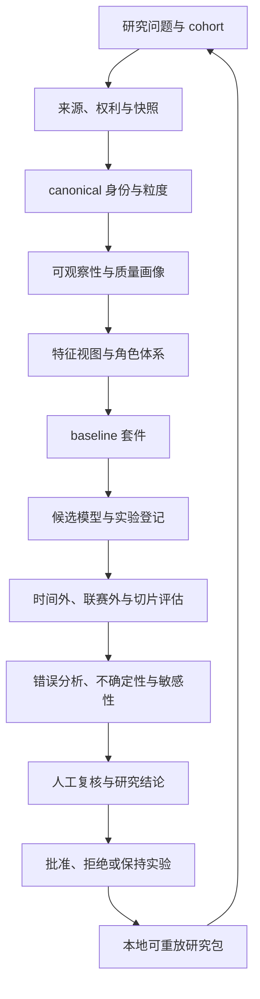

# 本地个人球员评分研究系统专项规划

> 状态：规划真源草案，2026-08-02 基于当前仓库、当前本地数据和当前可执行产物更新；下文仍保留历史缺陷证据，但当前激活状态以 `docs/TASKS.md` 和运行态 `research-health` 为准。
>
> 本文服从 [`PROJECT_CHARTER.md`](PROJECT_CHARTER.md) 的项目定位，实施顺序服从 [`TASKS.md`](TASKS.md) 的当前队列，长期共用基础设施服从 [`ROADMAP.md`](ROADMAP.md)。本文只规划“本地个人研究足球球员评分”这一核心方向，不把尚未开发的内容写成已有能力，也不设虚假的周、月或发布日期。

## 0. 文档用途

这份规划解决四个问题：

1. 当前系统究竟能回答什么球员评分问题，不能回答什么。
2. 当前评分、数据、模型、界面和工程体系中有哪些可复现缺陷。
3. 若把项目重新聚焦为个人在本机长期研究球员评分的系统，目标产品和研究架构应是什么。
4. 后续开发按什么依赖、门禁、验收证据和停止条件推进。

本文不是“多做几个模型、多加几个页面”的功能愿望清单。它要求每个新增能力都进入同一个可复现研究闭环：

`提出研究问题 → 固定人群与时间边界 → 固定数据快照 → 检查身份与覆盖 → 计算 baseline → 训练候选 → 时间外和切片评估 → 检查错误与不确定性 → 人工记录结论 → 导出可重放研究包`

## 1. 结论摘要

ScoutFootball 已有一个宽而深的本地原型：来源与许可登记、Parquet/DuckDB 数据层、球员评分优化器、候选模型登记、静态前端、API、个人工作区、动作价值、回测和模型门禁都已存在。问题不是“从零开始”，而是当前默认球员评分尚未形成可信的个人研究产品。

当前最重要的判断如下：

- 当前优化评分主要学习“球员聚合分数如何解释球队赛季积分”，不能直接等价为球员个人能力、个人贡献、未来潜力、角色适配或转会成功概率。
- 当前 `player_truth_labels.parquet` 有 50,777 行：21,037 行是 Transfermarkt 身价代理，29,723 行是派生 `expert_tier`，另有 17 行手工赛季奖项 benchmark。17 行均为赛季结束后标签，时间可用于因果训练的独立行数仍为 0；它们不能证明独立球员能力真值。
- 当前评分使用的主要特征仍是进球、助攻、出场量和非常粗的防守/控球代理；已进入特征矩阵的 xT、VAEP 并没有进入默认优化器评分函数。
- 当前评分产物已接入 canonical identity 解析链和显式 unresolved/ambiguous 标记，但 active 产物中只有 7 行已解析，其余不能被静默合并；同名球员、转会球员和多队赛季仍是研究限制。
- 当前角色分类过粗且有明显错位，没有 DM 等关键角色；门将仍受外场防守代理指标影响。
- 不同位置的评分分布相差很大，所以单一总分目前不适合直接跨位置比较。
- 当前 active MLP 已有匹配的 feature/source lineage、标准候选评分产物和晋级记录，`research-health` 会如实返回 `not_ready/insufficient_labels`，不会把可复核误写成已验证能力；可用球员特征主要覆盖 Big-5，当前 active scope 仍列出 15 个 unsupported target leagues。
- 当前真实比赛粒度证据只有 StatsBomb 样例的 94 条球员—比赛记录，其余 27,504 条 `player_match` 是赛季代理。不能把这些代理写成完整逐场研究数据。
- API、前端和测试面已经很宽，单体文件继续增大；若先扩展页面和模型，维护成本会进一步挤压真正的研究验证。

因此，近期主线应从“继续增加功能宽度”切换为：

1. 先让当前评分是否可用、为什么不可用、使用了什么数据一目了然。
2. 建立 canonical 球员—球队—赛季—赛事身份与明确的数据粒度。
3. 把“一个总分”拆成表现、角色适配、可靠性、证据质量、不确定性等可解释维度。
4. 建立朴素但可信的 baseline、独立标签和多切片评估，再训练复杂候选。
5. 把个人研究会实际重复做的操作收敛成研究项目、实验比较、球员档案和可重放导出四个工作区。

## 2. 定位与边界

### 2.1 核心用户

第一用户是维护者本人。系统应支持一个人在本机完成长期、可复查的球员评分研究，不依赖账号、云数据库、组织权限、订阅服务或在线协作。

适合支持的研究任务包括：

- 某联赛、赛季和位置组内的球员表现比较。
- 某球员跨赛季、跨球队和跨角色的变化分析。
- 某角色需求下的候选筛选和证据复核。
- 多种评分公式或模型在相同快照上的比较。
- 对某个异常排名、低置信度结果或模型分歧做原因分析。
- 保存自己的观察、标签、反证和最终结论，并在未来重新计算。

### 2.2 不应混为一个问题的目标

以下目标必须分开建模、分开命名、分开评估：

| 目标 | 回答的问题 | 不能偷换成 |
| --- | --- | --- |
| 当前表现 | 球员在给定时间窗和赛事中的已观察产出如何 | 固有能力、未来潜力 |
| 角色适配 | 球员对一个明确角色需求的匹配程度 | 全局球员高低 |
| 团队情境价值 | 球员特征与某球队/战术情境是否互补 | 脱离情境的能力 |
| 未来走势 | 在给定年龄、分钟和历史轨迹下，未来表现分布如何 | 确定性潜力 |
| 可用性与可靠性 | 样本量、分钟、伤停和稳定性如何 | 技术水平 |
| 证据质量 | 当前数据覆盖和来源可信度如何 | 球员表现 |
| 市场价值 | 某市场条件下的价格或交易概率 | 足球能力 |

市场价值、球队积分、媒体声誉、游戏数值或既有模型评分可以作为研究变量、对照或弱标签，但不能默认成为球员能力真值。

### 2.3 明确非目标

- 不做投注建议或收益承诺。
- 不做实时比赛指挥系统。
- 不默认构建 SaaS、商业版、组织账号、云协作或多租户权限。
- 不用页面数、路由数、测试数量或神经网络参数量作为成功标准。
- 不在缺少合法数据、独立标签和基线的情况下把 NN、GNN、Transformer、强化学习写成近期能力。
- 不把 StatsBomb 开放样例、赛季代理、模拟名单或模型概率写成完整实时事实。
- 不把一个综合分数包装成客观、普适、跨时代不变的球员真相。

## 3. 当前系统与证据快照

### 3.1 当前评分链

当前默认优化器大致执行：

`FBref / Understat / Football-Data → 聚合球员赛季特征 → 位置内标准化和手工合成 → 聚合至球队赛季 → 用球队积分优化权重 → 输出 player_ratings_optimized`

同时，项目还有另一条特征链：

`player_match / player_rolling / 动作价值 → rating_feature_matrix`

但当前优化器没有把 `rating_feature_matrix` 中的 xT、VAEP 等作为实际评分特征；它主要把该矩阵用于输入 hash 和真值标签身份桥接。这两条链在命名和用户理解上容易被误认为已经完整合流。

### 3.2 2026-07-29 本地审计事实

以下是当前本机快照，不代表未来运行时持续成立：

| 项目 | 当前观察 | 解释边界 |
| --- | ---: | --- |
| `validate` | 31/31 通过 | 证明本次文件、schema、部分唯一键和 lineage 检查通过，不证明评分语义正确 |
| 数据契约质量 | 27 个契约、7 个来源，当前检查通过 | 不证明来源事实、身份或快照仍然最新 |
| `rating_feature_matrix` | 26,678 行、40 列 | 当前 manifest hash 为 `951d5f39d6fd4b20` |
| 当前优化评分 | 30,483 行、41 列 | 产物早于当前特征矩阵 |
| 真值标签 | 29,723 行 | 全部为 `expert_tier`；独立合格标签 0 行 |
| 模型运行 | 41 个 | 可复核 0，不可复核 40，不可用 1 |
| 真实球员—比赛样例 | 94 行 | 来自 3 场 StatsBomb 样例 |
| 赛季代理球员记录 | 27,504 行 | 不是逐场事件或逐场表现 |
| 动作价值聚合 | xT 9,951 行；VAEP 6,771 行 | 数据粒度和赛事覆盖不同，尚未进入默认评分 |
| OOF 公平性产物 | 不存在 | 详细健康会回退到 synthetic demo，不能当真实评估 |
| 运行设备 | PyTorch CPU；CUDA 不可用 | 近期方案必须 CPU-first |

当前主要字段缺失情况：

- `rating_feature_matrix.passes` 和 `xT_added` 全缺失。
- xT 字段约 97.74% 缺失。
- VAEP 字段约 91.39% 缺失。
- 防守/杂项字段约 52.83% 缺失。
- npxG/xA 字段约 30.52% 缺失。
- `player_match` 中对手、主客场、传球、抢断、射正等比赛语境字段约 99.66% 缺失。

缺失率本身不必然说明数据错误，但它要求系统按来源、联赛、赛季和任务明确降级，不能用全局中位数掩盖成“完整特征”。

### 3.3 当前评分表现的研究风险

现有优化器的历史 holdout 相关指标可以说明“球队聚合分数与球队积分之间存在关系”，但不能独立证明球员排序正确。当前评分还有这些可见信号：

- 评分特征重要性主要集中在助攻、分钟和非点球进球代理。
- 当前所谓 `npg_p90` 在 Understat 路径中使用 `goals - goals * 0.1` 的近似，并非真实非点球进球。
- 防守合成主要由抢断成功、拦截、犯规、被犯规和传中组成。
- 控球合成主要由传中和被犯规组成，不能代表控球、推进、抗压或传球价值。
- 缺少防守/控球数据的来源会被位置中位数填为 50，可能把“未知”误写成“平均”。
- 门将核心一致性检查仍复用外场防守合成，缺少扑救质量、传中处理、出击和传球等门将语义。
- 当前角色只有 CM、CB、FB、W、ST、GK、AM 等粗分类，没有 DM；部分明显球员出现角色错位。
- 当前 2025/26 数据中各位置评分中位数差异很大，不能安全跨位置用一个数比较。
- 名字相同的不同球员和同赛季转会多队记录会影响按人名分组的趋势、经验和赛季排序。

这些现象应被视为研究假设和错误案例，不应被简单解释为“模型发现了传统认知之外的真相”。

## 4. 缺陷登记

### 4.1 优先级定义

| 等级 | 定义 |
| --- | --- |
| P0 | 会让研究结果被错误解释、错误发布或无法复现；后续评分功能必须先处理 |
| P1 | 不一定立刻产生错误，但会显著限制研究可信度、可解释性或日常可用性 |
| P2 | 在核心可信闭环建立后能提高深度、效率或研究范围 |
| P3 | 只有数据、算力和重复使用证据成熟后才值得启动的远期研究 |

### 4.2 总表

| ID | 优先级 | 缺陷 | 当前后果 |
| --- | --- | --- | --- |
| R-001 | P0 | “球员评分”的目标语义未固定 | 同一总分混合表现、球队成绩、可用性和角色差异 |
| R-002 | P0 | 没有独立合格真值标签 | 无法证明模型优于简单 baseline，也不能训练监督 NN |
| R-003 | P0 | 当前评分产物与现行特征快照漂移 | 用户可能查看不可复核的旧评分 |
| R-004 | P0 | 健康状态未区分数据健康和评分可发布 | 整体 `ok` 会掩盖 0 个可复核模型运行 |
| R-005 | P0 | canonical 身份没有贯穿评分结果和时序特征 | 同名、转会、多队赛季可能互相污染 |
| R-006 | P0 | 数据粒度混合且命名不够显式 | 赛季代理容易被误认为逐场证据 |
| R-007 | P0 | 缺失值被当作平均表现 | “未知”与“普通”无法区分 |
| R-008 | P1 | 默认评分未使用 xT/VAEP 等已开发特征 | 功能存在不等于评分受益 |
| R-009 | P1 | 角色体系过粗且有错位 | 位置内比较和角色解释不可靠 |
| R-010 | P1 | 跨位置分数未校准 | 全局榜单存在系统性位置偏置 |
| R-011 | P1 | 门将模型语义错误 | GK 分数不能解释为门将能力 |
| R-012 | P1 | 训练目标以球队积分为主 | 球队环境和出场量会替代个人贡献 |
| R-013 | P1 | 评价指标与任务不完全对齐 | team NDCG、相关性不能证明 player ranking |
| R-014 | P1 | 联赛强度常量缺少可追溯版本 | 跨联赛调整不可审计 |
| R-015 | P1 | 缺少不确定性和模型分歧 | 小样本与高覆盖球员看起来同样确定 |
| R-016 | P1 | 缺少稳定、可审计的 baseline 套件 | 复杂模型没有清楚的最低比较对象 |
| R-017 | P1 | 缺少实验注册与研究问题真源 | 运行产物很多，但“为什么运行”不够可追溯 |
| R-018 | P1 | 研究错误分析没有成为主流程 | 指标通过后仍难系统检查异常排名 |
| R-019 | P1 | 文档中的行数、路由数和状态快速漂移 | 手工能力表很快失真 |
| R-020 | P1 | API、前端、CLI 和测试单体过大 | 每次修改的回归面和维护成本持续上升 |
| R-021 | P1 | 全量 Python 测试无法在短反馈预算内完成 | 日常研究迭代缺少快速可信反馈 |
| R-022 | P2 | 缺少个人标签与复核工作台 | 人工知识无法系统进入对照和错误分析 |
| R-023 | P2 | 缺少敏感性、反事实和稳健性分析 | 不知道排名对权重、分钟门槛和缺失策略有多敏感 |
| R-024 | P2 | 动作价值与赛季评分缺少受控融合协议 | 不同粒度特征可能被直接拼接并产生泄漏 |
| R-025 | P2 | 缺少转会后或下一赛季结果反馈 | 无法检验评分是否支持实际个人决策 |
| R-026 | P2 | 缺少可重放研究包的一键导入 | 长期研究迁移与复核成本高 |
| R-027 | P3 | tracking/video 研究无合规完整样本 | 不能承诺离球、空间控制或自动视频评分 |

## 5. P0 缺陷的具体处理

### R-001：固定评分语义

根因是当前界面和产物围绕一个 `rating_score` 展开，但训练目标、特征和用户任务并不是同一个概念。

处理要求：

- 为每个评分定义 `rating_target_id`、名称、适用人群、时间窗、粒度、预测时点、可用特征截止时点和禁止解释。
- 默认先发布“位置/角色内的观察期表现评分”，不发布“综合能力真值”。
- 把团队积分代理模型改名为“team-outcome proxy model”，从默认球员能力榜中降级为对照实验。
- 每个评分结果必须携带 `model_version`、`dataset_snapshot_id`、`cohort_id`、`role_version` 和 `evidence_status`。
- UI 不允许只显示裸分；至少同时显示适用角色、时间窗、样本分钟、覆盖率和不确定性。

验收：

- 同一个分数在模型卡、API、导出和前端中的定义完全一致。
- 用户能回答“这个分数高代表什么”和“它绝对不代表什么”。
- 未声明目标语义的模型运行不能进入候选登记。

### R-002：建立独立标签，而不是复制当前评分

近期不需要追求大规模“客观真值”。对个人研究系统更现实的是建立小而干净、可追溯的评价集。

标签分层：

1. `human_pairwise_preference`：在同角色、相似分钟和同一观察窗口内，A 是否优于 B。
2. `human_tier`：维护者对明确 cohort 的分档，并记录信心和依据。
3. `external_reference`：合法取得的外部评分或奖项，只作为外部对照，保留来源与日期。
4. `future_outcome`：下一赛季分钟、表现变化、角色变化或转会后表现，只用于特定预测任务。
5. `model_derived`：既有模型输出，只能作为蒸馏、回归测试或弱标签，禁止命名为 truth。

验收：

- `player_truth_labels` 改为更中性的 `player_evaluation_labels`，或通过 schema 明确 `independence_status`。
- 每条标签有来源、观察窗口、创建者、创建时间、任务、置信度、证据引用和是否独立于候选模型。
- 默认训练只接收 `eligible_for_supervised_training=true` 的标签。
- 标签审计能报告模型衍生、外部参考和人工独立标签的占比。
- 在独立标签不足时，系统明确停留在 baseline/探索阶段，不自动绕过。

### R-003/R-004：评分产物新鲜度与分层健康

至少拆分五类状态：

| 状态 | 回答的问题 |
| --- | --- |
| `storage_health` | 文件是否存在、可读、schema 是否有效 |
| `lineage_health` | 上游 hash、manifest 和当前产物是否一致 |
| `model_reviewability` | 模型运行的训练证据能否复核 |
| `active_rating_freshness` | 当前展示评分是否来自当前批准模型和当前输入 |
| `research_readiness` | 对指定研究问题是否具备足够身份、覆盖、标签和评估 |

规则：

- 任何一层失败不得被顶层 `ok` 隐藏。
- 当前评分产物早于现行特征时，前端应显示“过期/不可复核”，而不是普通低置信度。
- 0 个 reviewable run 时，健康页不得把评分系统写成 ready。
- synthetic fallback 必须在字段和视觉上与真实产物分开，不能进入真实研究导出。
- 发布门禁应基于当前激活模型的完整 lineage，而不是只检查候选运行目录。

验收：

- 删除或替换评分产物后，健康状态按预期降级。
- 修改特征 manifest 后，当前评分立即变为 stale。
- 恢复匹配的批准模型和输入后，状态才恢复。
- API、CLI、前端和导出使用同一状态计算器。

### R-005：canonical 身份贯穿全链

目标主键：

`player_id + team_id + competition_id + season_id + observation_window + role_id`

需要处理：

- 同名不同人。
- 别名、重音符号、姓名顺序和缩写。
- 同一球员同赛季多队。
- 同一球队参加多个赛事。
- 赛季定义差异和跨年联赛。
- 外部来源 ID 的可撤销映射。

原则：

- 人名只用于显示，不用于时序分组和模型主键。
- 转会球员可以有多条 player-team-season 记录，但需要另有 player-season 聚合，并明确聚合规则。
- 无法确认的身份保持 unresolved，不能静默合并。
- 身份映射要保存候选、证据、人工决定、撤销记录和受影响产物。

验收：

- 已知同名样例不会互相污染。
- 转会球员的赛季总量不会重复计算。
- 任一评分能追溯到来源 ID 和身份决策。
- 身份映射变化会使受影响特征和模型 lineage 失效。

### R-006/R-007：粒度和缺失语义

每个数据集必须声明：

- 一行代表什么。
- 时间窗是什么。
- 是真实观测、聚合、代理、估算还是未记录。
- 哪些字段在该来源中理论上可观测。
- 缺失是 `not_recorded`、`not_applicable`、`not_available`、`filtered` 还是实际 0。

禁止：

- 把赛季代理命名成普通 `player_match` 而不显示 grain。
- 把未知防守数据默认填成 50 后当作真实平均表现。
- 把不同时间窗、不同赛事和不同队伍的特征不加标记地拼接。

可接受的缺失处理：

- 模型内显式 missing indicator。
- 按来源训练不同 baseline。
- 只在共同特征子集上比较。
- 对缺失敏感的候选降级或拒绝。
- 多重插补仅作为研究分支，并报告插补不确定性。

验收：

- 数据字典和 manifest 能机器读取粒度、缺失原因和可观察性。
- API 能按 `evidence_grain` 过滤。
- 同一研究 cohort 中每个球员都显示特征覆盖向量。
- 未知和实际 0 在存储、训练和展示中均可区分。

## 6. 目标评分产品

### 6.1 不再只输出一个数

默认球员档案建议输出：

| 输出 | 含义 | 推荐形式 |
| --- | --- | --- |
| `performance_index` | 给定角色和观察窗内的已观察表现 | 角色内 0–100 百分位或标准分 |
| `role_fit_score` | 对一个版本化角色需求的匹配 | 0–100，附分项和冲突 |
| `availability_score` | 分钟、首发、伤停与样本可用性 | 独立展示，不并入能力 |
| `trend_signal` | 跨时间窗变化 | 上升/稳定/下降 + 区间 |
| `evidence_coverage` | 特征和来源覆盖 | 百分比 + 缺失清单 |
| `uncertainty_interval` | 数据和模型不确定性 | 点估计 + 区间 |
| `model_agreement` | baseline 与候选是否一致 | 一致度 + 主要分歧 |
| `context_notes` | 联赛、球队、角色和战术限制 | 结构化文本 |

如果用户需要总分，可以提供版本化的 `composite_score`，但必须满足：

- 权重可见。
- 权重变化可重算。
- 不把 evidence coverage 当负面能力直接惩罚；覆盖不足应提高不确定性或阻止比较。
- 默认只在同一 cohort 和同一 role_version 内排序。
- 跨位置比较必须使用独立校准方案，并显示位置基准。

### 6.2 角色体系

建议采用“位置族 + 角色标签 + 任务特征”三层结构：

| 位置族 | 示例角色 |
| --- | --- |
| GK | shot stopper、sweeper keeper、build-up keeper |
| CB | stopper、cover、ball-playing CB、wide CB |
| FB/WB | defensive full-back、overlap、inverted full-back、wing-back |
| DM | anchor、ball winner、deep playmaker、half-back |
| CM | controller、box-to-box、carrier、advanced 8 |
| AM/W | creator、inside forward、touchline winger、wide playmaker |
| ST | poacher、target、pressing forward、link forward、channel runner |

角色不是由一个位置字符串硬推断。它应由：

- 真实位置/出场区域证据。
- 行为特征。
- 人工确认。
- 可选聚类建议。

共同决定。聚类只能提出候选角色，不能自动成为事实。

### 6.3 评分尺度

近期推荐保留三种尺度：

1. 原始可解释指标：每 90、占比、总量等。
2. cohort 内标准化值：用于同位置/角色比较。
3. 概率或排序输出：只用于有明确标签的任务。

不要在数据仍有限时强求全局 0–100。若使用 0–100：

- 说明 50、75、90 分分别对应什么分位。
- 固定参考 cohort。
- 版本变化后保留旧尺度映射。
- 不允许把不同 model_version 的 80 分直接比较。

## 7. 目标研究架构

### 7.1 数据层

建议分为：

- `raw_snapshot`：来源原始语义和许可。
- `identity_resolved`：保守身份映射，不修改原始数据。
- `observation_fact`：比赛、赛季或事件的事实表，粒度明确。
- `feature_view`：针对任务和预测时点构建。
- `label_set`：独立性、来源和适用任务明确。
- `experiment_run`：配置、输入 hash、代码版本、指标和错误样例。
- `rating_release`：只有通过门禁的研究版本。
- `research_project`：维护者的问题、选择、备注和结论。

### 7.2 模型层

模型层只提供同一协议下的候选：

- 规则/加权 baseline。
- 带经验贝叶斯收缩的稳定 baseline。
- 线性/正则化模型。
- 树模型。
- 排序模型。
- 只有标签足够后才考虑的神经网络。

模型复杂度不赋予更高地位。所有候选必须接受相同的时间边界、特征截止、切片评估和错误分析。

### 7.3 应用层

近期只需要四个核心工作区：

1. **研究项目：** 研究问题、cohort、数据快照、状态和结论。
2. **实验比较：** baseline、候选、指标、切片、分歧和晋级决定。
3. **球员档案：** 多维评分、原始证据、时间线、同类比较、反证和人工备注。
4. **质量与治理：** 来源、身份、覆盖、陈旧度、标签、模型准入和失败原因。

现有 24 个顶层视图不继续扩张。新功能优先作为上述工作区中的标签页、侧栏、抽屉或详情步骤。

## 8. 模型与评价协议

### 8.1 第一组可信 baseline

每个研究任务至少保留：

- `B0 raw_percentile`：角色内关键指标等权百分位。
- `B1 expert_weighted`：版本化透明权重。
- `B2 shrinkage`：按分钟/样本量向角色均值收缩。
- `B3 regularized_linear`：只在独立标签足够时使用 Ridge/Elastic Net。
- `B4 gradient_boosting`：只有能证明切片收益时作为候选。
- `B5 current_team_points_proxy`：保留现有优化器，但明确作为球队结果代理对照。

任何复杂候选必须说明相对 B0/B1/B2 改善了什么；若只改善球队积分相关性而恶化独立人工排序，不得晋级为球员评分。

### 8.2 数据切分

禁止随机混合所有赛季后切分。根据任务至少包含：

- 时间外 holdout。
- 联赛外 holdout。
- 球队外 holdout。
- 转会球员切片。
- 低分钟与高分钟切片。
- 年龄段切片。
- 位置族与细角色切片。
- 数据来源与特征覆盖切片。
- 强弱球队切片。
- 新赛季冷启动切片。

同一球员的相邻赛季进入训练和测试时，要检查是否符合预测时点；用于当前表现复述和未来预测的规则不同。

### 8.3 指标矩阵

| 维度 | 指标示例 | 目的 |
| --- | --- | --- |
| 排序 | Spearman、Kendall、pairwise accuracy、NDCG@K | 检查相对顺序 |
| 误差 | MAE、RMSE、分位误差 | 检查数值偏差 |
| 校准 | reliability curve、ECE、coverage of interval | 检查概率和区间 |
| 稳定性 | bootstrap rank interval、赛季扰动、权重扰动 | 检查排名是否脆弱 |
| 公平切片 | 位置、年龄、联赛、来源、分钟 | 检查系统性偏差 |
| 覆盖 | 可评分比例、完整特征比例、拒绝比例 | 防止只在少数样本上取得好分 |
| 研究效用 | shortlist recall、人工复核节省、异常发现率 | 检查个人工作流价值 |

指标要求：

- 同时报分母、样本量和置信区间。
- 不用 team-level 指标证明 player-level 真值。
- NDCG@K 的 K 必须对应真实候选规模；不能在只有约 20 支球队时把 team NDCG@20 写成精细 Top-20 能力。
- 每个候选至少输出最差切片，而不是只展示总体平均。

### 8.4 不确定性

近期可实现且 CPU 友好的方法：

- 基于比赛/赛季重采样的 bootstrap。
- 基于分钟数的经验贝叶斯收缩。
- baseline 与候选的模型分歧。
- 特征覆盖导致的区间扩张。
- 权重与 cohort 扰动后的排名区间。

用户看到的应是：

`估计值 + 区间 + 样本量 + 覆盖 + 主要敏感因素`

而不是只有两位小数的确定性排名。

### 8.5 防泄漏检查

每次实验自动检查：

- 预测时点之后的数据是否进入特征。
- 目标变量或其直接变体是否进入特征。
- 当前模型输出是否进入独立标签。
- 球队结果、市场价值和奖项是否被误用为能力真值。
- 同一球员/球队的未来赛季是否泄漏到训练。
- 特征标准化是否在全数据上拟合。
- 角色推断是否使用了测试期信息。

PlayeRank 的后续复核研究已经展示过目标泄漏会让球员排名看似更好；本项目应把泄漏审计做成机器门禁，而不是模型卡中的可选说明。

## 9. 专项实施路线

路线只按依赖推进，不按日期推进。每个阶段都可以在退出证据不足时停止。

### PRS-0：当前评分真实性止血

状态建议：`ready`

目标：在继续训练或扩展评分前，让用户准确知道当前评分是否新鲜、可复核和适用于什么。

交付：

- 分层健康状态。
- 当前 active rating 的完整 lineage。
- 评分产物与特征 hash 一致性门禁。
- synthetic fallback 隔离。
- 当前模型/标签/粒度/覆盖的自动事实页。
- 清理过时的 `PROBLEMS.md`、`EVALUATION.md`、`MODEL_CARD.md` 手工事实。
- 修复当前 Ruff 阻断并建立短反馈测试命令；这属于后续实现任务，不在本规划文档中直接修改代码。

退出门槛：

- 当前评分 stale 时，CLI、API 和前端一致拒绝写成 ready。
- 0 个 reviewable run 时，健康状态明确降级。
- 一个命令能生成当前研究状态报告，文档不再手工复制易漂移行数。
- 维护者能在 5 分钟内判断“当前榜单能否用于研究”以及不能用的原因。

### PRS-1：身份、粒度和 cohort 内核

状态建议：`blocked`，依赖 PRS-0

目标：建立所有评分实验共用且不会静默合并的研究数据集。

交付：

- canonical player/team/competition/season ID。
- player-team-season 与 player-season 两种明确视图。
- `evidence_grain`、`observation_type` 和缺失原因枚举。
- cohort 定义和 hash。
- 角色体系 v1。
- 身份冲突复核队列。
- 转会、多队赛季、同名球员的固定测试集。

退出门槛：

- 核心评分表不再使用人名作模型主键。
- 已知身份冲突全部保持 unresolved 或有人工证据。
- 赛季代理与真实逐场数据在 API/UI/导出中不可混淆。
- cohort 重新运行能得到同一成员与相同 hash。

### PRS-2：透明 baseline 与评分语义 v1

状态建议：`blocked`，依赖 PRS-1

目标：在没有大规模独立标签之前，先提供可解释、可复算、有不确定性的角色内表现评分。

交付：

- B0/B1/B2 baseline。
- 明确角色内指标定义。
- 分钟收缩。
- 位置/角色内标准化。
- coverage、uncertainty 和 sensitivity。
- 现有球队积分优化器改名并降级为对照。
- 门将独立 baseline。

退出门槛：

- 任一分数可从原始字段手工复算。
- 同一 cohort 内榜单有 bootstrap 排名区间。
- 跨位置比较默认关闭或明确校准。
- GK 不再使用外场防守代理作为核心指标。
- 缺失数据不会被静默解释为平均能力。

### PRS-3：个人评价集与标签工作台

状态建议：`blocked`，依赖 PRS-1，可与 PRS-2 后半段并行

目标：积累小而可信的个人研究评价集，为模型比较提供独立证据。

交付：

- pairwise 和 tier 标签 schema。
- 标签创建/修改/撤销历史。
- 盲评模式：标注时可隐藏候选模型分数。
- 冲突、低信心和待复核队列。
- 外部参考标签导入协议。
- 标签独立性审计。

退出门槛：

- 至少一个明确角色和时间窗拥有可用的独立评价集。
- 同一球员的标签能追溯到证据和观察窗口。
- 模型衍生标签无法通过默认监督训练门禁。
- 标签一致性和维护者复测稳定性有报告。

### PRS-4：实验注册、候选模型和严谨评估

状态建议：`blocked`，依赖 PRS-2 + PRS-3

目标：在统一协议下比较模型，而不是以最新运行或最高单指标替代研究判断。

交付：

- 研究问题/实验/运行三层登记。
- 固定配置和输入 hash。
- 时间外、联赛外、转会、分钟、位置和覆盖切片。
- baseline 对比。
- 错误样例和最大排名分歧。
- 候选晋级、拒绝、回滚和失效日期。
- 模型卡自动事实区。

退出门槛：

- 候选相对 baseline 的收益在预先声明的主要指标和关键切片中成立。
- 最差切片、覆盖下降和失败样例都可见。
- 晋级需要维护者决策文本，不按单指标自动执行。
- 已晋级版本可在隔离目录完整重放。

### PRS-5：个人研究工作区

状态建议：`blocked`，依赖 PRS-2；完整模型比较依赖 PRS-4

目标：让维护者不用在多个页面、命令和手工文件之间拼接研究过程。

交付：

- 新建研究项目。
- cohort builder。
- 研究状态总览。
- 模型/评分版本比较。
- 球员 dossier。
- 异常排名和低置信度队列。
- 个人备注、反证、结论和版本历史。
- 本地导入导出。

退出门槛：

- 能从研究问题走到有证据的个人结论。
- 刷新或重启后研究项目仍可恢复。
- 导出的研究包在另一隔离数据根目录可读和可核验。
- 所有结论显示数据快照、评分版本、coverage 和人工状态。

### PRS-6：动作价值受控融合

状态建议：`blocked`，依赖 PRS-1 + PRS-4，且只在有事件数据的 cohort 启动

目标：把 xT/VAEP 从“旁路存在”变成可比较的特征分支，而不是把稀疏字段直接塞入默认评分。

交付：

- 事件数据的赛事/赛季/球队/球员身份对齐。
- action → match → season 的聚合协议。
- xT baseline 与 VAEP baseline。
- 共同覆盖 cohort。
- 有/无动作特征的消融实验。
- coverage 和 domain-shift 报告。

退出门槛：

- xT/VAEP 的粒度、模型版本和来源明确。
- 默认实验不会在 90% 以上缺失的全局 cohort 上直接插补使用。
- 增益在共同覆盖样本和时间外 holdout 中存在。
- 没有动作数据的球员不会被解释为动作价值为零。

### PRS-7：结果反馈与决策效用

状态建议：`blocked`，依赖 PRS-5 和足够时间跨度

目标：检验评分是否帮助维护者更快发现值得研究的球员、减少遗漏或识别风险。

交付：

- shortlist 时点快照。
- 下一赛季/转会后结果观察。
- 选择、拒绝和后来结果的版本化记录。
- 命中、遗漏、误报和反事实复盘。
- 研究时间成本记录。

退出门槛：

- 结果指标在选择时未泄漏。
- 能区分模型推荐、人工决定和实际结果。
- 不用少量成功案例宣传模型有效。
- 至少一个重复研究任务证明系统比当前手工替代更有用。

### PRS-8：空间、tracking 和视频研究

状态建议：`blocked`

只有以下条件同时满足才启动：

- 有合法、可本地保留的样本。
- 格式映射和 FIFA EPTS 等相关标准边界已记录。
- tracking 供应商误差和同步误差可量化。
- PRS-1 至 PRS-6 的身份、粒度、评估和研究工作区已经可复用。

可研究方向：

- 接球前扫描、空间占用、压迫和防线控制。
- 球员/球事件/视频时间轴对齐。
- 视频片段作为评分证据回链。
- 离球贡献和情境相似性。

停止条件：

- 只有演示片段，没有可验证数据质量。
- 许可不允许本地研究或导出。
- tracking 误差大于要研究的动作差异。
- 该方向不能服务维护者的重复研究任务。

## 10. 功能积压清单

以下是规划项，不是已交付承诺。

### 10.1 研究项目与数据

- `PRS-DATA-001` 研究项目 schema：问题、目标、预测时点、cohort、版本和结论。
- `PRS-DATA-002` cohort DSL：联赛、赛季、年龄、分钟、位置、球队、数据覆盖。
- `PRS-DATA-003` cohort 预览：纳入、排除及每个排除原因。
- `PRS-DATA-004` canonical identity migration report。
- `PRS-DATA-005` 同名/别名/转会冲突固定 fixture。
- `PRS-DATA-006` player-team-season 与 player-season 双视图。
- `PRS-DATA-007` observation grain registry。
- `PRS-DATA-008` 缺失原因枚举和字段可观察性矩阵。
- `PRS-DATA-009` 数据快照 diff：新增、删除、身份变化和字段分布变化。
- `PRS-DATA-010` 数据漂移报告：来源、联赛、角色和赛季切片。
- `PRS-DATA-011` 可重放的 feature view 配置。
- `PRS-DATA-012` 特征时点审计和泄漏扫描。

### 10.2 评分和模型

- `PRS-MODEL-001` 角色内 raw percentile baseline。
- `PRS-MODEL-002` 透明权重 baseline。
- `PRS-MODEL-003` 分钟/样本收缩 baseline。
- `PRS-MODEL-004` 门将独立 baseline。
- `PRS-MODEL-005` 当前球队积分优化器重命名和任务隔离。
- `PRS-MODEL-006` 候选线性模型。
- `PRS-MODEL-007` 候选树模型。
- `PRS-MODEL-008` pairwise ranking 候选。
- `PRS-MODEL-009` 模型一致性/分歧矩阵。
- `PRS-MODEL-010` bootstrap 排名区间。
- `PRS-MODEL-011` 权重敏感性。
- `PRS-MODEL-012` 分钟门槛敏感性。
- `PRS-MODEL-013` cohort 敏感性。
- `PRS-MODEL-014` 缺失策略消融。
- `PRS-MODEL-015` 特征族消融。
- `PRS-MODEL-016` 联赛强度版本化与去除实验。
- `PRS-MODEL-017` active model freshness gate。
- `PRS-MODEL-018` champion/challenger 比较。
- `PRS-MODEL-019` 自动失效日期和数据漂移触发。
- `PRS-MODEL-020` 评分版本兼容性和迁移说明。

### 10.3 标签和人工研究

- `PRS-LABEL-001` pairwise 标签。
- `PRS-LABEL-002` cohort tier 标签。
- `PRS-LABEL-003` 盲评模式。
- `PRS-LABEL-004` 标签证据引用。
- `PRS-LABEL-005` 低信心和冲突队列。
- `PRS-LABEL-006` 标签复测和一致性报告。
- `PRS-LABEL-007` 外部参考导入。
- `PRS-LABEL-008` 模型衍生标签隔离。
- `PRS-LABEL-009` 标签撤销和影响分析。
- `PRS-LABEL-010` 主动抽样：优先标注模型分歧最大但证据充分的 pair。

### 10.4 评价与错误分析

- `PRS-EVAL-001` 时间外 holdout。
- `PRS-EVAL-002` 联赛外 holdout。
- `PRS-EVAL-003` 转会球员切片。
- `PRS-EVAL-004` 位置/角色切片。
- `PRS-EVAL-005` 年龄和分钟切片。
- `PRS-EVAL-006` 数据来源/覆盖切片。
- `PRS-EVAL-007` 强弱球队切片。
- `PRS-EVAL-008` 最大绝对误差列表。
- `PRS-EVAL-009` 最大排名分歧列表。
- `PRS-EVAL-010` 置信区间覆盖。
- `PRS-EVAL-011` 最差切片晋级门禁。
- `PRS-EVAL-012` 评估分母和排除原因报告。
- `PRS-EVAL-013` 泄漏审计。
- `PRS-EVAL-014` 复现实验 diff。
- `PRS-EVAL-015` 人工反证记录。

### 10.5 本地研究体验

- `PRS-UX-001` 新建研究项目向导。
- `PRS-UX-002` cohort builder 和实时覆盖预览。
- `PRS-UX-003` 评分定义卡。
- `PRS-UX-004` 球员多维 dossier。
- `PRS-UX-005` 同角色对比。
- `PRS-UX-006` 跨赛季时间线。
- `PRS-UX-007` 模型版本对比。
- `PRS-UX-008` 异常排名队列。
- `PRS-UX-009` 低证据/高不确定性队列。
- `PRS-UX-010` 敏感性控制面板。
- `PRS-UX-011` 证据和反证备注。
- `PRS-UX-012` 研究结论签署。
- `PRS-UX-013` 本地搜索和保存筛选。
- `PRS-UX-014` 可访问键盘操作和移动阅读。
- `PRS-UX-015` 一键导出研究包。
- `PRS-UX-016` 隔离目录导入和完整性校验。

### 10.6 工程与维护

- `PRS-ENG-001` 生成式研究状态页，替代手工行数。
- `PRS-ENG-002` 分层健康状态。
- `PRS-ENG-003` 评分领域 API 路由模块化。
- `PRS-ENG-004` 评分领域前端模块化。
- `PRS-ENG-005` CLI 命令按研究流程分组。
- `PRS-ENG-006` 快速门禁测试集。
- `PRS-ENG-007` 完整测试集分片与耗时预算。
- `PRS-ENG-008` flaky/slow 测试登记。
- `PRS-ENG-009` schema 兼容和弃用策略。
- `PRS-ENG-010` 本地备份、恢复和迁移验证。
- `PRS-ENG-011` CPU 基准和内存预算。
- `PRS-ENG-012` 可选 GPU 能力探测，不使 CPU 主路径退化。

## 11. 个人研究工作流设计

### 11.1 新建研究

用户必须先选择：

- 研究问题。
- 评分目标。
- 联赛和赛季。
- 位置族/角色。
- 最低分钟。
- 数据截止时点。
- 可接受的数据来源。
- 输出：探索、shortlist、模型比较或长期跟踪。

系统随后只做预览，不立即训练：

- cohort 人数。
- 排除人数和原因。
- 身份冲突。
- 关键字段覆盖。
- 可用 baseline。
- 可用独立标签。
- 预计运行成本。

### 11.2 运行研究

运行必须生成：

- 不可变配置。
- 输入快照和 hash。
- 代码版本。
- 环境版本。
- 随机种子。
- baseline 结果。
- 候选结果。
- 切片指标。
- 错误样例。
- 日志和失败状态。

运行失败保留失败证据，不产生成功占位符。

### 11.3 复核球员

球员 dossier 至少显示：

- 身份和队伍/赛事时间线。
- 当前 cohort 和角色。
- 原始关键指标。
- 多维评分及区间。
- 与相似球员的差异。
- 数据覆盖和缺失。
- 模型分歧。
- 排名敏感性。
- 支持证据。
- 反证和风险。
- 维护者备注和结论。

### 11.4 结束研究

研究可以是：

- `accepted_for_personal_use`
- `exploratory_only`
- `rejected`
- `blocked_by_data`
- `superseded`

结束时导出：

- `research_manifest.json`
- cohort 成员和排除清单。
- 数据契约和快照引用。
- 评分定义和模型卡。
- 指标和错误分析。
- 人工结论。
- 文件 hash。
- README 和复现命令。

## 12. 工程收敛计划

### 12.1 模块边界

当前 `api.py`、`api_server.py`、`frontend/app.js`、`__main__.py` 和大型评价模块继续增长会拖慢研究迭代。拆分应围绕稳定领域，而不是机械按行数切文件：

- `rating/contracts`
- `rating/cohorts`
- `rating/features`
- `rating/baselines`
- `rating/experiments`
- `rating/evaluation`
- `rating/admission`
- `rating/research_projects`
- `rating/export`

前端对应：

- research project shell
- cohort builder
- player dossier
- experiment comparison
- quality/admission

拆分验收不是“文件变小”，而是：

- 一个领域变更不需要触碰无关世界杯、战术板或比赛预测逻辑。
- 领域接口有 schema 和契约测试。
- 浏览器 E2E 按研究工作流覆盖，而不是按每个 DOM 函数覆盖。

### 12.2 测试层级

建议建立：

- `check:rating-fast`：schema、身份、cohort、baseline、admission，目标几分钟内。
- `check:rating-integration`：隔离数据根的完整小样本研究。
- `check:rating-browser`：新建研究、查看 dossier、导出包。
- `check:full`：全仓测试，允许更长时间并分片。

测试数量不作为质量结论。必须报告：

- 收集是否成功。
- 运行是否完成。
- 通过/失败/跳过数。
- 运行时长。
- 是否使用真实数据、fixture 或 synthetic fallback。

### 12.3 文档自动事实

以下内容不再手工维护：

- 路由数量。
- 前端视图数量。
- 测试文件和测试用例数量。
- 关键 Parquet 行数、schema、hash 和更新时间。
- 模型运行数与 reviewable 状态。
- 标签来源分布。
- 特征缺失率。
- active rating 与 feature manifest 一致性。

生成式报告只描述本次本地快照，并附运行时间和命令。

## 13. 数据与算法的现实取舍

### 13.1 CPU-first

当前环境无 CUDA，个人本地系统也不应把 GPU 作为基本门槛。近期优先：

- pandas/DuckDB/Polars 可控聚合。
- scikit-learn 线性和树模型。
- 可并行 bootstrap。
- 预计算特征和缓存。
- 小规模超参数搜索。

只有复杂模型在固定 baseline、固定评价集和时间外切片上持续带来有意义收益，才考虑 GPU。

### 13.2 小而可信优于大而混杂

若完整共同覆盖 cohort 只有数百或数千人，也优于把不同粒度、不同缺失语义和不同身份质量的三万行直接合成一个“全球榜单”。

应允许多个受限评分：

- 某联赛/赛季的角色内表现评分。
- 有事件数据赛事中的动作价值评分。
- 有独立人工标签 cohort 的研究候选。

不强求所有评分立即统一。

### 13.3 开放数据边界

StatsBomb Open Data 适合建立可复现实验和动作价值样例，但覆盖有限，公开使用需保留要求的来源归属。`socceraction` 可作为 SPADL、xT 和 VAEP 的方法参考，但其官方仓库目前强调研究复现且不再积极开发，不能把依赖存在等同于持续维护保障。

tracking 与视频数据应参考 FIFA EPTS 数据格式和测试思路，但标准存在不证明某个本地数据集已达到相应准确性。

## 14. 风险登记

| 风险 | 概率 | 影响 | 缓解 |
| --- | --- | --- | --- |
| 独立标签长期不足 | 高 | 高 | 先发布透明 baseline 和探索工具，不虚构监督能力 |
| 来源字段覆盖差异过大 | 高 | 高 | 来源内 baseline、共同覆盖 cohort、显式缺失语义 |
| 身份修复影响历史产物 | 高 | 高 | 版本化映射、影响分析、全链失效和可回滚迁移 |
| 评分再次被误解为能力真值 | 高 | 高 | 目标卡、禁止解释、角色内默认和不确定性 |
| 页面和 API 继续膨胀 | 高 | 中 | 顶层视图冻结、领域模块化、研究工作流优先 |
| 全量测试反馈过慢 | 高 | 中 | fast/integration/browser/full 分层 |
| 复杂模型吸引力挤压基线工作 | 中 | 高 | 独立标签和 baseline 作为硬门禁 |
| xT/VAEP 覆盖不足造成选择偏差 | 高 | 中 | 单独 cohort 和消融，不做全局静默插补 |
| 联赛/时代迁移失效 | 中 | 高 | 时间外和联赛外 holdout、版本失效日期 |
| 维护者标注受到模型锚定 | 中 | 高 | 盲评、随机 pair、复测和记录可见信息 |
| 本地磁盘或环境变化破坏复现 | 中 | 高 | 内容 hash、锁定环境、研究包和恢复演练 |
| tracking/video 数据不可得 | 高 | 中 | 保持 P3，不把它作为核心路线依赖 |

## 15. 成功标准

项目不以“做出最先进模型”为完成。专项方向取得实质成功，需要同时满足：

1. 维护者能定义一个明确的球员评分研究问题。
2. 系统能显示该问题的数据覆盖、身份冲突和不可回答部分。
3. 至少一个透明 baseline 可以完整重算。
4. 候选模型必须相对 baseline 在时间外和关键切片上提供证据。
5. 任一球员结论能追溯到原始来源、快照、特征、评分版本和人工判断。
6. 低样本、缺失、模型分歧和排名敏感性可见。
7. 当前评分过期或不可复核时，系统明确拒绝写成 ready。
8. 一次研究可导出、迁移、重新打开和核验。
9. 同一真实个人任务被重复使用，且系统确实减少了手工拼接或提高了反证能力。
10. 项目在 CPU、本地文件和个人维护成本下仍可持续。

## 16. 近期开发取舍

在 PRS-0 至 PRS-2 完成前，默认暂停以下扩展：

- 新的顶层前端视图。
- 未建立独立标签的 NN/GNN/Transformer/RL 评分。
- 把 sparse xT/VAEP 直接并入全局总分。
- 用更多外部来源掩盖身份和粒度问题。
- 全局跨位置排行榜的强化展示。
- tracking/video 自动评分承诺。
- 云同步、组织协作和商业化功能。

可以继续的工作仅限：

- 修复会造成错误研究结论的缺陷。
- 完成当前 I1 已开始切片的最小收尾和文档证据。
- 建立 PRS-0/PRS-1 所需的共享契约、测试和迁移工具。
- 改善现有个人研究闭环，而不是增加独立功能岛。

## 17. 外部方法依据

- [socceraction 官方仓库](https://github.com/ML-KULeuven/socceraction)：SPADL、xT、VAEP 的开放研究实现与适用边界。
- [StatsBomb Open Data 官方仓库](https://github.com/statsbomb/open-data)：开放数据覆盖和发布归属要求。
- [FIFA EPTS Standard Data Format](https://quality.fifa.com/innovation/standards/epts/research-development-epts-standard-data-format)：tracking 数据交换与可比性的标准背景。
- [FIFA EPTS Testing Process](https://inside.fifa.com/innovation/standards/epts/epts-testing-process)：tracking 系统精度验证思路。
- [PlayeRank](https://arxiv.org/abs/1802.04987)：角色感知、多维球员表现评价的研究参考。
- [Revisiting PlayeRank](https://arxiv.org/abs/2410.20038)：目标泄漏和权重复核对球员评分可信度的影响。

这些资料只用于方法设计。外部研究结论、开放代码和标准不能替代本项目自己的数据许可、复现、切片评估和人工判断。

## 18. 需要维护者逐步作出的研究决定

这些决定不阻止先完成 PRS-0，但会影响 PRS-2 之后的方向：

- 第一套长期重复使用的研究 cohort 是哪个联赛、赛季和角色。
- 默认评分首先表达“当前表现”还是“角色适配”。
- 维护者愿意投入怎样的独立标签方式：pairwise、tier 或两者结合。
- 第一套门将角色指标采用哪些可合法获得的数据。
- 跨位置比较是否确实是个人研究刚需；如果不是，应长期默认关闭。
- 当前球队积分优化器是保留为研究对照，还是在新版 baseline 稳定后停止维护。
- xT/VAEP 首先在哪个共同覆盖赛事中验证，而不是直接推广到所有球员。

这些决定必须记录成研究项目或 ADR，不埋在模型参数和界面默认值里。
