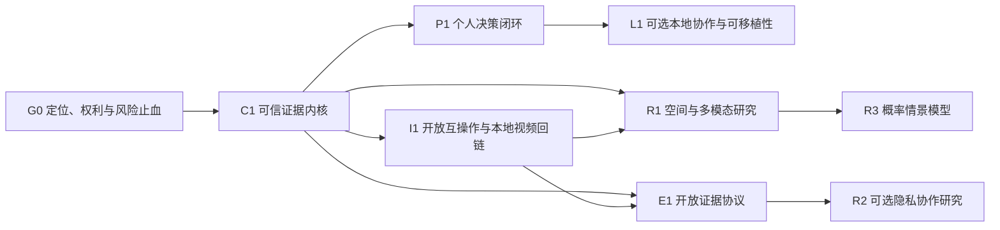

# ScoutFootball 长期开发顺序与工程路线图

> 更新日期：2026-07-29。项目定位以 [`PROJECT_CHARTER.md`](PROJECT_CHARTER.md) 为准，球员评分专项缺陷与实施门禁见 [`PLAYER_RATING_RESEARCH_SYSTEM_PLAN.md`](PLAYER_RATING_RESEARCH_SYSTEM_PLAN.md)，行业工具与技术取舍见 [`FOOTBALL_TOOLING_LANDSCAPE_2026.md`](FOOTBALL_TOOLING_LANDSCAPE_2026.md)，当前能力边界见 [`CAPABILITIES.md`](CAPABILITIES.md)，当前可执行队列以 [`TASKS.md`](TASKS.md) 顶部为准。
>
> 本路线图不设置周、月、年份、发布日期或完成期限。节点只受前置依赖、启动条件和退出门槛约束；后序方向可以无限期暂停、跳过或停止。

## 1. 北极星

ScoutFootball 的长期定位是：**本地优先、开放源代码、个人维护、非盈利、供应商中立且可审计的足球证据到决策工作台**。

第一服务对象是维护者本人以及具有相似需求的个人足球爱好者、独立分析者和研究学习者。开放代码允许其他个人或组织复用，但项目不以客户、收入、市场份额、企业部署或服务合同为目标。

当前开发焦点进一步收敛为：**维护者在本机长期研究足球球员评分的可复现系统**。世界杯、招募、比赛准备、动作价值、互操作和战术工具只有在复用可信数据、身份、评分、实验与证据包内核，或直接支持一项真实个人研究任务时才继续扩展。评分专项的目标语义、缺陷登记、功能积压和 PRS-0 至 PRS-8 门禁以 [`PLAYER_RATING_RESEARCH_SYSTEM_PLAN.md`](PLAYER_RATING_RESEARCH_SYSTEM_PLAN.md) 为准；本文保留跨场景的长期公共依赖。

项目不以页面数、路由数、数据行数或模型参数量为成功标准，而以三件事衡量：

1. 一项足球决策能否从需求追溯到授权来源、数据快照、模型、反证和人工结论。
2. 同一输入能否重放出同一结果，并在数据、契约或模型失效时明确拒绝发布。
3. 个人能否在本机完成、保存、迁移和复核完整工作流，并按需导出证据包，而不被迫注册账号或把敏感数据交给默认云服务。

产品结构采用“一个核心、多个场景包”：

- **ScoutFootball Core：** 来源/许可、快照/lineage、身份、契约、模型治理、证据包、工作区和适配器。
- **Player Rating Research Pack：** 研究问题、cohort、角色内 baseline、独立标签、候选比较、不确定性、球员档案和可重放研究包；这是当前第一参考实现。
- **World Cup Pack：** 世界杯赛程、简报、路径、战术与赛后复盘的参考实现。
- **Recruitment Pack：** 招募需求、角色匹配、长名单、shortlist、决策档案和结果反馈。
- **Opposition & Match Pack：** 对手分析、情景、战术计划、视频/事件证据和赛后学习。
- **Academy Pack：** 青训发展和长期轨迹；只有未成年人和敏感数据治理成熟后启动。

## 2. 三个黄金工作流

所有近期工作必须至少服务一个黄金工作流；不能说明归属的顶层功能默认不开发。

### A. 球探决策

`需求简报 → 覆盖检查 → 长名单 → 角色内比较 → shortlist → 证据档案 → 人工复核 → 决策 → 结果回灌`

### B. 比赛准备

`赛程 → 输入快照 → 来源受限简报 → 对手模式 → 情景假设 → 战术板 → 交付 → 赛后对照`

### C. 数据与模型发布

`授权输入 → 快照 → 质量检查 → 特征 → 训练 → holdout/切片 → 模型卡 → 候选比较 → 发布/拒绝 → 监控/回滚`

## 3. 跨节点工作流与依赖图

以下九条是长期项目主干，节点只决定深度：

| 工作流 | 长期结果 |
| --- | --- |
| W1 可信数据内核 | 每个字段和派生产物具有来源、许可、`as_of`、hash、schema 和删除策略 |
| W2 身份与时间 | 球员、球队、赛事、阵容、比赛时钟和视频时钟可保守解析、复核和撤销 |
| W3 模型治理 | baseline、时间外 holdout、校准、切片、晋级、回滚和失效日期成为强门禁 |
| W4 决策工作区 | 人工判断、反证、覆盖和结果形成版本化证据包 |
| W5 足球场景包 | 世界杯、招募、对手分析和学院共享核心协议，不重复造基础设施 |
| W6 互操作生态 | 授权供应商适配器保存原始语义，并输出转换损失和许可边界 |
| W7 空间与多模态 | 只在合规数据和质量基线下研究追踪、视频、离球和情景模拟 |
| W8 可靠工程 | 模块化、数据契约测试、真实浏览器 E2E、失败即阻断、可重建发布 |
| W9 安全与治理 | 本地默认、最小数据、备份/审计/加密/删除先于任何可选联网或共享能力 |

箭头表示必要依赖，不表示工期。只有节点的退出门槛全部通过，后继节点才被解锁；被解锁也不等于必须启动。

## 4. G0/G1：定位、权利与可信基线

G0-A 与 G0-B 可以并行；G1 必须等待二者全部通过。三者均已验证（2026-07-17）；C1 已于 2026-07-23 验证通过。当前状态以 [`TASKS.md`](TASKS.md) 顶部为准。

### G0-A：个人工作流与数据权利

- 以维护者的真实使用为基准，分别记录球探决策、比赛准备、数据/模型研究的输入、步骤、输出、常见错误和当前替代工具。
- 至少选定一个当前确实会重复使用的参考工作流，并保存一次端到端任务证据；其他工作流可以保持候选、降级或停止。
- 建立假设登记：每条工作流和技术假设有证据、反证、置信度、下一测试和停止条件。
- 对实际拥有或可合法取得的数据建立权利清单；未确认许可、保存、处理和导出边界的数据源不进入后续承诺。
- 外部个人可以自愿参与任务测试，但不把用户数量、采用意愿、付费意愿或组织需求作为解锁条件。

#### G0-A 退出门槛

- [`PROJECT_CHARTER.md`](PROJECT_CHARTER.md) 已与 README、路线图和任务队列一致。
- 至少一个参考工作流有真实输入、实际输出、阻断记录和重复使用理由。
- 近期输入的数据权利和本地保存边界明确；未知权利不会被排入后继节点。

### G0-B：真实性、运行时与发布止血

- 删除关键发布步骤的 `continue-on-error`、`|| true` 和成功 placeholder；关键验证失败必须停止。
- 修复标准 `uv` 运行时并执行关键 Parquet 内容级 preflight；不可读文件立即隔离，不能进入 API、静态快照或模型。
- 对关键数据记录 schema、row-group、writer、hash、行数、统计、可读性和删除状态。
- 明确所有部署引用的 URL、访问模式、版本和健康检查；无法验证时只写“未核验”。线上部署不是项目成功前提。
- 修复 `scripts/demo.sh` 的端口说明和启动参数，确保本地同源启动路径可复现。

#### G0-B 退出门槛

- 关键 Parquet 在锁定运行时全部可读，或被明确隔离且不会进入产品。
- 任一关键构建、训练或验证失败都不会产生“成功发布”。
- 本地标准启动、静态回退和失败状态可重现；文档不把构建成功写成线上可达。

### G1：黄金流程与契约基线（依赖 G0-A + G0-B）

- 建立最小机器可读 capability registry，记录状态、模块、入口、数据契约、数据依赖、静态策略、测试和最后验证时间。
- 从 FastAPI/OpenAPI、静态映射、导航定义、CLI 和模型登记自动生成清单；人工文档只解释，不手工复制易漂移数字。
- 将来源、许可、快照和 `recorded/not_recorded` 要求纳入统一数据清单。
- 为被声明支持的黄金流程引入真实浏览器测试，覆盖 API LIVE、静态 STATIC、OFFLINE、空数据、低覆盖、字段缺失、移动断点和导入恶意字符串。
- 固定小型、可合法提交或在 CI 生成的 golden fixtures；未被维护者选择的流程不强行纳入范围。
- 断言导出的 JSON/CSV/报告对外部事实和派生结论保留 source snapshot、data contract、model、coverage 和本地状态。
- 构建时生成静态 manifest；陈旧、schema 不一致或缺关键文件时阻断。
- 暂停新增顶层视图和宽路由，除非修复问题或完成已选工作流的缺失步骤。

#### G1 退出门槛

- 已声明支持的参考工作流在真实浏览器 fixture 中通过，失败和低覆盖状态也有断言。
- 新生成决策包中的外部事实和派生决策主张 100% 拥有来源快照、数据契约版本、覆盖和人工/模型状态；人工备注保留作者、时间和类型，不伪造外部来源。
- API/静态关键契约对同一快照一致；manifest 新鲜度成为发布门禁。
- README、章程、能力表、路线图、任务顶部和前端状态不再对同一事实给出冲突口径。

#### 后置维护项

- [x] `TASKS.md` 顶部只保留已解锁队列，将历史交付日志按版本归档（[`history/TASKS-2026-07-17.md`](history/TASKS-2026-07-17.md)；`scripts/archive_tasks_history.py --check` 验证链接和真源边界）。
- [x] 为 `frontend/app.js`、`api.py` 和 `api_server.py` 写模块边界 ADR（[`adr/0001-core-module-boundaries.md`](adr/0001-core-module-boundaries.md)）；每次只拆一个能降低参考工作流风险的低耦合 seam，不承诺全面重构。
- [x] 建立最小文档生成和陈旧度报告（[`REFERENCE_INDEX.md`](REFERENCE_INDEX.md) 由 `project_manifest.json` 生成并受 `generate_manifest.py --check` 校验）；更完整的 registry UI 留到 C1。

### G0/G1 非目标

- 新的深度模型、全新顶层导航、实时协作、视频识别、商业数据抓取。

## 5. C1：可信证据内核（依赖 G1）

### 目标

把可信度从 UI 提示升级为数据和代码强制执行的内核。

### 具体交付

首个实施切片以已在使用的 3.1 数据导入与验证工作流为验收载体：内容级
Parquet preflight 可以生成本地证据报告，并且只关联已经登记的 contract、
source license、snapshot 与 lineage；缺失元数据保持 `not_recorded`。这不是
对 C1 退出门槛已完成的声明。

#### 5.1 来源与许可登记

- `source_id`、供应商、数据集/比赛、版本、获取方式、许可、署名、允许用途、再分发、保存期和删除动作。
- 导出策略引擎：对公开、内部、受限和不可分发内容采用不同报告/静态导出行为。
- 来源健康报告：最后成功快照、陈旧度、字段变化、覆盖变化和条款复核日期。

#### 5.2 快照与 lineage

- 在授权保存期内使用 append-only、内容寻址 raw snapshot，记录 hash、`as_of`、获取时间和转换运行 ID。
- 许可撤销、法定删除或保存期到期时删除原内容或执行密钥销毁；保留不含原内容的删除凭证/tombstone，并使相关派生产物失效。
- 字段级 lineage 或足够细的列组 lineage；报告可回到输入、代码、参数和数据契约版本。
- 对旧产物使用明确的 `not_recorded`，不补造历史快照。

#### 5.3 身份工作台

- 确定匹配、候选、冲突、拒绝和无法解析五态。
- 显示姓名、生日、国籍、球队、赛季、来源主键和证据矩阵；人工确认有版本和撤销。
- 覆盖按来源、联赛、赛季、位置、性别、年龄层和场景切片，不以总体覆盖掩盖问题。

#### 5.4 契约注册与质量 SLO

- API、静态 JSON、CSV/JSON 导出、本地工作区和 Parquet 使用版本化 schema。
- 兼容策略包含新增可选字段、弃用、迁移和拒绝规则。
- 数据质量至少覆盖可读性、唯一性、完整性、范围、时间一致性、来源许可、身份冲突、陈旧度和 API/静态一致性。

#### 5.5 模型晋级与回滚

- 每个候选保存数据快照、feature manifest、标签政策、时间切分、baseline、指标、校准、切片和错误案例。
- 明确 promote/reject/rollback；NN 或复杂模型不因总体指标单点提升自动晋级。
- 输出适用范围、拒绝输出条件和模型失效日期。

### 退出门槛

- 三个黄金流程中所有外部事实、派生结论和必需 provenance 字段经过 registry；人工假设/备注使用显式类型、作者、时间和清洗规则，允许受控自由文本。
- 新来源不填写许可、快照、适用时的身份策略和删除策略就无法进入 gold 层。
- 模型候选可在同一快照一键复算并与 baseline 对比；回滚经过测试。
- 身份冲突不会被静默选择；人工撤销后所有相关派生产物可追踪失效。

## 6. P1：个人决策闭环（依赖 C1）

### 目标

把“可看页面”变成维护者能够在本机重复完成、保存、复核和迁移的招募与比赛分析工作。

### 具体交付

#### 6.1 Recruitment Pack v1 — brief 层 `verified`（2026-07-23）

- 版本化需求 brief：球队、位置、角色、预算、年龄、合同、联赛、语言/资格、时间和风险偏好。
- 角色本体：用户可编辑职责和指标，不把固定位置权重包装成普适真理。
- 长名单与敏感性：展示推荐如何随权重、最低分钟、联赛和覆盖阈值变化。
- 决策档案：候选、支持证据、反证、视频时间码、比较对象、风险、人工意见和最终建议。
- 结果回灌：试训、签约/未签、出场和人工复盘；反馈先作为独立事实，不自动训练。

退出证据（brief 层）：`src/scoutfootball/recruitment/contracts.py` 作为 Recruitment pack 与 Core `schemas/storage.py` 类型的唯一复用层，为 3 类 artifact（`brief`/`role_profile`/`decision_dossier`）构建 `DataContract`/`SnapshotInfo`/`LineageEntry`，不复制身份、快照或导出逻辑。`RecruitmentFactType` 枚举区分 3 类事实（`scouting_requirement`/`role_profile`/`decision_dossier`），每类有对应 license（maintainer-local MIT）/snapshot/coverage 配置；`role_profile` 显式标为 `status="provisional"`（角色定义非普适真理）。`brief.py` 定义 `RecruitmentBrief` Pydantic 模型（frozen, extra=forbid），字段校验覆盖 position_group/risk_tolerance/age_range。`store.py` 实现本地 JSON 存储：原子写（temp file → fsync → replace）、备份（更新/删除前 copy2）、乐观并发（`expected_revision` If-Match 语义，409 conflict / 428 precondition_required）、record envelope（`scoutfootball.recruitment-brief-record` v1.0.0）。CLI 4 命令（`create-brief`/`list-briefs`/`show-brief`/`validate-brief`）支持 `--from-json`、`--json` 输出和 `SCOUTFOOTBALL_DATA_ROOT` 隔离。API 4 端点（`GET /recruitment/contracts` registry、`GET /recruitment/briefs` list、`GET /recruitment/briefs/{brief_id}` single、`POST /recruitment/briefs` create）在 `api_server.py` 注册。`architecture.py` 登记 `recruitment` 模块边界和 `recruitment.briefs` 能力。测试覆盖：`test_recruitment_contracts.py` 47 测试（fact_type 标注、contract builders、registry、serialization）+ `test_recruitment_brief.py` 56 测试（model 校验、id 安全、save/load/list/count/delete、乐观并发、备份、损坏记录、round-trip）+ `test_recruitment_cli.py` 17 测试（create/list/show/validate 全路径含错误退出）。全量 417 测试通过；ruff clean。brief 层满足 P1 退出门槛第 2 条"需求 brief 到有人工结论的证据包可 round-trip，冲突和本地边界清晰"的 brief 侧；role_profile/decision_dossier/结果回灌层待后续迭代。

#### 6.2 Opposition & Match Pack v1

- 从赛程和授权输入生成来源受限简报，区分官方、记录、估计和未知。
- 模式卡可回到比赛、动作和视频时间码，显示样本数、对手/比分状态和稳定性。
- 情景树连接战术板：领先/落后、不同阵型、人员缺席和定位球。
- 赛后对照“假设—计划—执行—结果”，记录被证伪的模式和新问题。

退出证据（briefing 层）：`src/scoutfootball/opposition/contracts.py` 作为 Opposition pack 与 Core `schemas/storage.py` 类型的唯一复用层，为 4 类 artifact（`briefing`/`pattern_card`/`scenario_tree`/`post_match_review`）构建 `DataContract`/`SnapshotInfo`/`LineageEntry`，不复制身份、快照或导出逻辑。`OppositionFactType` 枚举区分 4 类事实（`match_briefing`/`pattern_card`/`scenario_tree`/`post_match_review`），每类有对应 license（maintainer-local MIT）/snapshot/lineage/coverage 配置；`briefing` 与 `post_match_review` 标为 `status="delivered"`，`pattern_card` 与 `scenario_tree` 标为 `status="provisional"`（工作假设非认证真相）。lineage 记录三段链路：模式卡依赖 briefing+events、情景树依赖 briefing+pattern、赛后对照依赖 briefing+scenario+silver match facts。`briefing.py` 定义 `OppositionBriefing` Pydantic 模型（frozen, extra=forbid），`BriefingSection` 携带 `fact_tier`（official/recorded/estimated/unknown）和 `section_id` 分类法（6 个标准 id + `custom:<tail>` 前缀），段间 section_id 唯一。`store.py` 实现本地 JSON 存储：原子写（temp file → fsync → replace）、备份（更新/删除前 copy2）、乐观并发（`expected_revision` If-Match 语义，409 conflict / 428 precondition_required / 404 not_found）、record envelope（`scoutfootball.opposition-briefing-record` v1.0.0），读取时重新校验 briefing payload 并校验 briefing_id 与文件名一致。CLI 4 命令（`create-briefing`/`list-briefings`/`show-briefing`/`validate-briefing`）支持 `--from-json`、`--section`/`--section-evidence` 段构建（含 `custom:` 前缀解析）、`--json` 输出和 `SCOUTFOOTBALL_DATA_ROOT` 隔离。API 4 端点（`GET /opposition/contracts` registry、`GET /opposition/briefs` list、`GET /opposition/briefs/{briefing_id}` single、`POST /opposition/briefs` create）在 `api_server.py` 注册。`architecture.py` 登记 `opposition` 模块边界和 `opposition.briefings` 能力。测试覆盖：`test_opposition_contracts.py` 53 测试（4 类 fact_type、contract builders、lineage 上游、registry、serialization）+ `test_opposition_briefing.py` 63 测试（section 校验、fact_tier 四档、custom section_id、model frozen、id 安全、save/load/list/count/delete、乐观并发、备份、损坏记录、round-trip）+ `test_opposition_cli.py` 35 测试（create 含 section/evidence 标志与 custom 段、list、show、validate 不落盘、错误退出）。全量 151 测试通过；ruff clean。briefing 层满足 P1 退出门槛第 2 条"需求 brief 到有人工结论的证据包可 round-trip，冲突和本地边界清晰"的 briefing 侧；pattern_card/scenario_tree/post_match_review 实体层待后续迭代。

#### 6.3 World Cup Pack 参考化 — `verified`（2026-07-23）

- 将现有赛程、阵容、概率、淘汰路径、简报和战术计划迁移到 Core 契约。
- 对正式名单、预计征召、伤停、阵容评分覆盖和模型概率使用不同事实类型。
- 发布一套可复现公开 demo 快照和教学脚本，作为适配器与证据包参考实现。

退出证据：`src/scoutfootball/worldcup/contracts.py` 作为 World Cup pack 与 Core `schemas/storage.py` 类型的唯一复用层，为全部 7 个 artifact 构建 `DataContract`/`SnapshotInfo`/`LineageEntry`，不复制身份、快照或导出逻辑。`WorldCupFactType` 枚举区分 5 类事实（`official_roster`/`expected_callup`/`injury_report`/`rating_coverage`/`model_probability`），每类有对应 license/snapshot/coverage 配置；`official_roster` 与 `injury_report` 显式登记为 `status="missing"`/`"not_tracked"` 而非静默缺失。8 个 API 端点（schedule/teams/groups/predictions/tournament_summary/match_briefing/tactical_plan/tournament_state）注入 contract 字段；新增 `GET /world-cup/contracts` registry 端点；`TournamentState` schema 升级到 1.1.0 嵌入 contract，1.0.0 状态向后兼容（无 contract 字段时返回 None）。`scripts/demo_snapshot/export_worldcup_demo_snapshot.py` 提供可复现 demo 快照：剥离 volatile timestamp keys（`generated_at`/`updated_at`/`created_at`/`recorded_at`/`as_of`）后计算 SHA-256，`--check` 模式验证 manifest 一致性。端到端验证：导出 6 个 JSON 文件 + 7 contracts manifest + README，`--check` 全部通过（6/6 文件 hash 一致）。测试覆盖：`tests/unit/test_worldcup_contracts.py` 116 测试（fact_type 标注、contract builders、registry、serialization、data.py bindings、tournament state round-trip、1.0.0 向后兼容、8 个 API 端点 contract emission）+ `tests/unit/test_demo_snapshot_script.py` 11 静态分析测试。全量 297 测试通过；ruff clean。满足 P1 退出门槛第 4 条"世界杯包与招募/比赛包复用 Core，没有复制身份、快照或导出逻辑"。Recruitment Pack（6.1）和 Opposition & Match Pack（6.2）分支不要求同时完成，维护者先解锁自己实际重复使用的分支。

#### 6.4 产品体验

- 以工作流导航替代继续堆顶层页面；提供“下一步、缺失证据、阻断原因”。
- 桌面优先但完成 760px 阅读/复核；复杂战术编辑可以保持桌面限定并明确提示。
- 支持版本 diff、冲突合并、备份、恢复和可移植离线包。

退出证据（产品体验层）：`frontend/index.html` 新增两个顶层视图：`view-workflow`（工作流导航）与 `view-versions`（版本与备份），side-nav 注册 `data-view="workflow"` 和 `data-view="versions"` 入口。`frontend/app.js` 实现 `renderWorkflow`（推断可执行下一步、阻断项、缺失证据；从 review-queue / watchlist / shortlist / briefs / briefings 派生本地状态）和 `renderVersions`（按 brief/briefing 列出备份时间线、字段级 diff、按 If-Match 语义恢复）以及 portable pack 导出（含 SHA-256 哈希校验）。`frontend/style.css` 增加 `.wf-step-list`、版本时间线、diff 显示样式，并在 `@media (max-width: 760px)` 下调整 padding/字号/`feature-metric-strip` 折行；战术板编辑控件在窄屏禁用并显示桌面限定提示。`src/scoutfootball/storage/record_diff.py` 提供 `diff_records` 字段级比较（处理嵌套 dict、list 和 envelope 元数据），`tests/unit/test_record_diff.py` 23 测试覆盖。`recruitment/store.py` 与 `opposition/store.py` 修复 `_read_record` 接受 `expected_id` 以支持备份文件名解析，`list_backups` 排序键修正为 `-(b.get("revision") or 0)`。API 端扩展：`/recruitment/briefs/{brief_id}/backups`、`/recruitment/briefs/{brief_id}/backups/{filename}`、`/recruitment/briefs/{brief_id}/diff`、`/recruitment/portable-pack`（opposition 对应端点同构），在 `api.py` 实现并在 `api_server.py` 注册。`architecture.py` 的 `frontend.analyst_console` 能力追加 `workflow` 和 `versions` 视图，与 `tests/unit/test_capability_registry.py` 中"每个前端视图必须在能力登记表中找到引用"的契约对齐。测试覆盖：`tests/unit/test_brief_backup_restore.py` 23 测试（BriefStore + BriefingStore 共享备份文件命名约定的 list/load/restore/cross-store 隔离）+ `test_record_diff.py` 23 测试。全量 4133 单元测试 + 23 集成测试通过（2 skipped）；ruff clean；`node --check` 通过 `app.js` 与 `scouting-workspace.js`。满足 P1 退出门槛第 1 条"维护者能够从真实输入独立完成至少一个参考工作流"的产品体验层：工作流导航把 brief/briefing 评审状态、watchlist/shortlist 与复盘证据聚合为可执行下一步；版本与备份层提供字段级 diff 与 If-Match 恢复；760px 阅读路径让窄屏可读，复杂编辑保持桌面限定并明示。冲突合并 UI 层未实现，留待后续迭代。

### 退出门槛

- 维护者能够从真实输入独立完成至少一个参考工作流，并在另一轮重放中得到一致、可解释的结果；外部个人测试只作为自愿补充反馈。
- 需求 brief 到有人工结论的证据包可 round-trip，冲突和本地边界清晰。
- 所有可行动推荐均显示覆盖、来源、敏感性和至少一个可检查证据；没有证据的项目只能标为“待验证假设”并阻断行动建议。
- 世界杯包与招募/比赛包复用 Core，没有复制身份、快照或导出逻辑。

P1 的 Recruitment、Opposition & Match、World Cup 三个分支不要求同时完成。维护者先解锁自己实际重复使用的分支，其他分支保持阻塞或停止。

## 7. I1：开放互操作与本地视频回链（依赖 C1 契约稳定，并有一个 P1 工作流作为验收载体）

### 目标

允许个人带入自己合法拥有的本地数据和视频引用，同时保持原始语义、隐私和权利边界。

### 具体交付

- Provider Adapter SDK：manifest、能力协商、schema mapping、raw passthrough、转换损失、测试夹具和版本兼容。
- 首批只支持用户提供的文件导入与少数明确授权 API；连接器不内置凭据或绕过访问控制。
- 事件层对齐 SPADL/atomic-SPADL；追踪层对照 kloppy、FIFA EPTS 和 Common Data Format。
- 视频回链支持时间码、播放列表/XML/CSV 和本地路径；证据包默认存引用而非复制视频。
- 事件/追踪/视频同步输出每场质量报告：偏移、漂移、不可匹配段和置信度。
- 建立适配器兼容矩阵和社区贡献安全审查；许可不明的适配器不能进入官方目录。

### 退出门槛

- 至少三类异构来源通过同一黄金流程，但转换后仍能回到各自 raw 语义。
- 适配器升级不会静默改变既有派生产物；breaking change 有迁移和回滚。
- 视频证据引用在有权环境中可解析，在无权环境中安全降级而不泄露路径或内容。
- 同步失败段不会进入需要连续追踪的模型。

### 非目标

- 转售第三方数据、托管完整视频库、承诺所有供应商统一语义。

## 8. L1：可选本地协作与可移植性（依赖已稳定的 P1；非主线）

### 目标

在不建设账号系统、云同步、多租户或企业平台的前提下，让个人工作区更容易备份、迁移、比较和通过文件交给他人复核。

### 具体交付

- 可移植工作区包：版本、manifest、hash、数据许可摘要、证据、模型卡和导入预览。
- 本地项目目录与可选本机用户配置分离；敏感文件支持用户自行选择的本地加密。
- 备份、恢复、冲突预览、差异比较、撤销和删除验证保持离线可用。
- 通过文件、只读报告或用户自行选择的外部版本工具协作，不建设实时云协作、组织账号或集中托管。
- 阵容、招募和比赛任务模板仍是个人本地对象，所有财务或内部评价字段只来自用户合法输入。
- 本地健康页显示数据质量、模型失效、存储、任务失败和适配器状态，不向项目维护者上传遥测。

### 退出门槛

- 一台新机器可以通过文档和本地包恢复参考工作流，不依赖公共云或项目方服务。
- 导出前能看见包含的数据、许可和敏感字段；导入不会静默覆盖已有工作区。
- 所有共享都由用户显式触发；默认安装不会创建远程身份、远程存储或遥测通道。

### 非目标

- SaaS、私有团队版、企业部署、RBAC 组织系统、实时协作、SLA 和定制运维。

## 9. R1：空间、离球与多模态实验室（依赖 C1 + I1，以及合规数据）

### 启动条件

- 有明确许可的事件、追踪和/或视频样本。
- 身份和时钟同步质量可量化，画面外和缺帧有显式状态。
- 每个研究任务有规则/统计 baseline、时间外和跨赛事评估、错误案例和计算预算。

### 研究组合

| 方向 | 先做的基线 | 可能扩展 | 产品化门槛 |
| --- | --- | --- | --- |
| 空间控制 | 几何/Voronoi、速度约束、占用图 | 概率控场和角色条件化 | 跨视角/供应商稳定、误差区间可见 |
| 离球跑动 | 规则检测、接应/拉开/冲刺 | 时序表示、动作意图候选 | 专家一致性、反事实和域外验证 |
| 压迫与防守 | 距离/速度/封堵线规则 | 图模型、团队协同 | 不把不可见球员当静止，位置误差传播 |
| 视频检索 | 人工标签、时间码、特征检索 | 多模态 embedding、自然语言检索 | 权利、误检成本、可回到原片段 |
| 战术模式 | 序列聚类、模板匹配 | GNN/Transformer | 比简单基线有稳定增益且可解释失败 |
| 情景模拟 | 重采样、规则和概率模型 | 可控生成/世界模型 | 条件和不确定性透明，不输出必然建议 |

### 原则

- 模型优先帮助“找证据、找反例、提出假设”，而不是直接替代教练判断。
- 研究代码与默认产品隔离；没有晋级报告不进入主导航和当前能力说明。
- 对女子、青年、不同联赛和非广播视角分别建立基线，不能只报告总体平均。

## 10. 远期开放与研究分支

这些分支彼此独立，不组成必须完成的最终阶段。

### E1：开放足球证据协议（依赖 C1 + I1）

- 发布足球证据包、模型卡、身份候选和转换损失的开放规范。
- 建立可公开再分发的小型基准和合成测试夹具，覆盖身份、时钟、低覆盖、静态/API 契约和决策复盘。
- 为女子足球、青训、非顶级联赛和不同采集方式建立独立评估套件，但不收集或发布受限个人数据。
- 开放协议必须能被另一个独立实现读写，不能只是 ScoutFootball 私有格式改名。

### R2：隐私保护的协作研究（可选；依赖 E1 和单独安全评审）

- 只研究由参与者主动运行的本地评估、公开模型卡或经过批准的聚合结果交换。
- 不建设跨俱乐部服务、集中训练平台、联邦学习 SaaS 或用户数据池。
- 任何实验必须先通过隐私、反推风险、公平性、撤回和删除审查；没有明确研究参与者时保持停止。

### R3：概率情景模型（可选；依赖 R1）

- 条件化阵容、状态和策略进行本地情景模拟，输出分布、反事实和失效域。
- 必须持续与简单概率基线、人工分析和真实赛后结果比较；不能以视觉说服力替代验证。
- 没有稳定的域外增益、可解释失败和可接受本地计算成本时，不进入默认能力。

## 11. 质量指标与研究观察

这些指标用于保护本地结果的可信度和可复现性，不用于增长、留存、转化、收入或商业部署考核。

### 11.1 核心指标

| 指标 | 定义与分母 | 触发点与检查方式 | 节点门槛 |
| --- | --- | --- | --- |
| 决策包证据完整率 | 满足必需 provenance 的新生成决策包数 / 含外部事实或派生主张的新生成决策包数；必需项为来源快照、数据契约、覆盖、模型/人工状态 | 每次导出与发布，由决策包 validator 检查 | 100% |
| 黄金流程场景通过率 | CI 中通过的必需场景断言数 / 当前声明支持的全部必需场景断言数；场景矩阵含 LIVE/STATIC/OFFLINE/空/低覆盖/字段缺失/安全导入 | 每个相关变更与发布，由浏览器 CI 检查 | 100% |
| 关键发布 fail-open 数 | 关键步骤失败但 workflow 仍产出成功状态或可发布资产的运行次数 | 每次运行检查 CI/release 记录 | 0 |
| API/静态一致率 | 同 snapshot 下通过 schema 与关键语义比较的静态映射数 / 当前关键静态映射总数；关键清单由 registry 版本化 | 每次静态构建运行 contract test + manifest 检查 | 100% |
| 无标记低覆盖强结论数 | 在测试、审计或本地报告中发现的无醒目标记低覆盖强结论 | 每次发布及主动质量审计 | 0 |

以下指标先建立审计基线，再基于风险和样本量设阈值，不能预填任意百分比：

- **身份误合并率：** 人工审计样本中确认错误的自动确定匹配数 / 被审计自动确定匹配数；冲突候选不计为误合并，但必须可见。
- **来源错误率：** 审计外部事实中来源、快照、许可或 `as_of` 错误的主张数 / 被审计外部事实主张数。
- **结果复盘完成率：** 被维护者标为“应复盘”且已有结果的证据包中，完成结果与假设复盘的数量 / 应复盘数量。
- **证据相关性：** 人工审阅为“直接支持、间接支持、反证、无关”的证据分布；不能只测是否存在链接。

### 11.2 个人工作流观察

在维护者重复运行参考工作流时记录：

- 从需求/赛程到首个可复核证据包的中位时间。
- 工作流是否能仅依靠仓库文档完成，以及具体阻断步骤。
- 推荐被人工接受、修改、拒绝和标为证据不足的分布。
- 冲突、低覆盖和模型不确定性是否被正确理解。
- 同一任务相对现有 Excel/PDF/视频流程节省或增加的时间。

这些观察只用于判断个人工作流是否值得继续维护，不设置采用率或增长目标。

## 12. 节点通用准入门槛

### 新数据源

必须先有许可、获取方式、缓存/删除、`as_of`、实体映射、失败模式、质量切片和公开导出边界。

### 新模型

必须先有任务/标签定义、简单 baseline、时间切分、指标、校准、切片、公平性、错误案例、输入 hash、模型卡、晋级和回滚。复杂度不是晋级理由。

### 新视图或路由

必须映射到黄金流程、复用现有契约、定义 LIVE/STATIC/OFFLINE/空/低覆盖、完成安全输出、移动阅读和浏览器 E2E。否则优先做详情、标签页或报告模板。

### 新写入或文件协作能力

必须有 schema 版本、原子写入、备份、冲突、导入预览、撤销和删除。本地文件、浏览器状态和同机服务端状态在 UI 与导出中必须分开；云同步和组织账号不在当前章程范围内。

### 新发布

必须保存代码版本、依赖、数据/静态 manifest、测试、许可、签名状态、资产 hash、部署目标、健康检查和回滚说明。构建成功不等于线上可达。

## 13. 长期非目标

- SaaS、订阅、付费层、企业版、销售/获客、收入目标和商业服务路线。
- 强制账号、默认遥测、默认云同步、多租户、组织账号和实时云协作。
- 全球数据抓取聚合和绕过供应商访问控制。
- 摄像机、GPS/可穿戴硬件或医疗记录系统。
- 转会撮合网络、经纪人 CRM、票务、球迷互动或俱乐部全套 ERP。
- 以单一总分替代球探、教练或医疗判断。
- 实时博彩、自动交易和“保证结果”的预测。
- 由项目集中持有敏感健康、合同、内部评价或未成年人数据。
- 为了技术潮流在没有任务和证据时引入大模型、GNN、强化学习或分布式系统。

## 14. 路线决策规则

每次选择下一项任务时按以下顺序排序，不按功能新颖程度排序：

1. 是否修复真实性、安全、许可或可恢复性问题？
2. 是否完成黄金工作流的明显断点？
3. 是否提高证据完整、可复现和维护者工作流完成率？
4. 是否复用 Core 并降低长期复杂度？
5. 是否有维护者真实使用证据或可复现实验，而非功能想象？
6. 数据权利、本地计算资源和个人维护责任是否明确？

任何节点都允许因为证据不足而停止或后退。路线图是有门槛的选择顺序，不是承诺把所有项目都实现。
