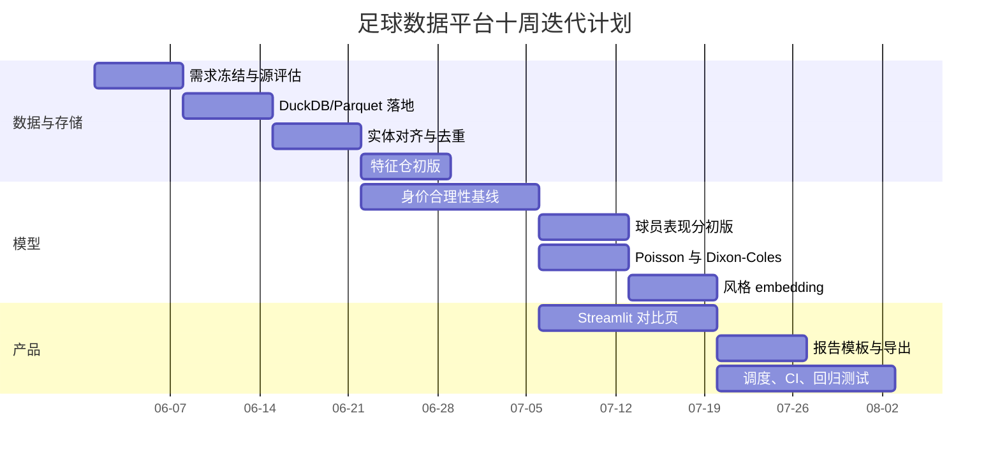
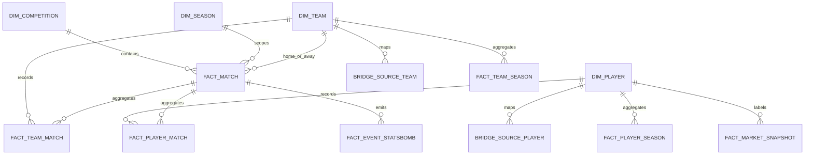

# 用 Codex 开发足球数据平台的分析报告

> **历史资料（已被新战略取代）：** 本文保留早期数据源和建模调研背景，但其中的内部 `turn...` 引用不可移植，部分时间敏感事实、数据行数、优先级和能力状态未经 2026-07-16 重新核验。当前市场判断使用 [`FOOTBALL_TOOLING_LANDSCAPE_2026.md`](FOOTBALL_TOOLING_LANDSCAPE_2026.md)，当前能力使用 [`CAPABILITIES.md`](CAPABILITIES.md)，未来顺序使用 [`ROADMAP.md`](ROADMAP.md)。不要从本文直接创建新任务。

## 执行摘要

这个项目最合理的落地路径，不是“先把所有网站都爬一遍”，而是先按**合规性、稳定性、字段价值、可复现性**做数据源分层：用 **StatsBomb Open Data** 做官方事件流主源，用 **Understat** 补充公开 xG、xA、xGChain、xGBuildup，用 **Football-Data.co.uk** 提供结果与赔率基线，用 **Club Elo** 提供球队强度时间序列；**FBref** 只建议保留为标准表与补充源，因为 Sports Reference 已在 **2026-01-20** 公告移除了 FBref 的 advanced data，且其 Bot Traffic 页面明确说明 FBref/Stathead 超过约 **10 次/分钟** 会被限流或封禁；**Transfermarkt** 则不应做自动化抓取，因为其官方条款明确禁止 bots、screen scraping，以及将数字内容用于 AI/机器学习系统训练。citeturn19view0turn11search7turn11search4turn27search0turn27search1turn27search5turn7search2turn7search4turn28search0turn28search1turn35search0turn35search4turn35search6turn4view1

建模上，不建议把“球员水平”直接压成一个单一神秘分数。更稳妥的做法是拆成四个可解释输出：**表现分**、**身价合理性**、**转会匹配概率**、**风格 embedding**。其中前两项是核心；比分预测用 **Poisson / Dixon-Coles** 作为非核心模块即可，不要让它反客为主。工程上，本地开发优先 **DuckDB + Parquet**，因为 DuckDB 原生高效读写 Parquet 且支持投影/过滤下推；后期当需要多用户 API、行级权限、索引与分区时再迁移 **PostgreSQL**。模型验证统一采用**时间序列切分**，树模型解释优先用 **Permutation Importance + SHAP TreeExplainer**，概率输出再做**校准**。这些技术路线都有成熟官方文档支撑。citeturn2search11turn2search7turn15search0turn15search4turn14search0turn17search1turn14search2turn17search0

如果目标联赛、预算、保存时长目前都未指定，建议先把范围收紧到 **Big 5 + 欧战 + 最近 5–10 季**。这样既能覆盖主流转会市场与公开数据分布，也能把实体对齐、缺失处理、模型迭代控制在一个单机可管理的复杂度内。未指定项建议如下。

| 项目 | 当前状态 | 建议默认值 |
|---|---|---|
| 目标联赛 | 未指定 | Big 5 + UCL/UEL，后续再加荷甲/葡超/巴甲等 |
| 目标人群 | 未指定 | 先做研究型内部工具，再做公开只读版 |
| 数据保留时长 | 未指定 | Bronze 原始缓存 12–24 个月；Gold/Feature 长期保存 |
| 部署预算 | 未指定 | 本地单机开发；阶段二单台 2–4 vCPU / 8–16GB RAM VPS |
| 预测时窗 | 未指定 | 身价与转会：未来 180/365 天；比赛：未来一场/一周 |

## 范围界定与阶段规划

这个平台的正确顺序应当是：**先把数据治理和标签定义做扎实，再做模型，再做漂亮界面**。原因很简单：在足球分析里，模型质量通常先被**数据错配、标签错期、样本泄露**拖垮，而不是先被算法上限拖垮。尤其你要做“球员是否配得上身价”和“转会匹配概率”，这两个问题都天然依赖严格的**时间切片**与**实体对齐**。这意味着 MVP 的重点不是模型花样，而是可复现、可审计的数据管线。

### 分阶段交付方案

| 阶段 | 目标 | 具体可交付物 | 优先级 | 里程碑 | 验收标准 |
|---|---|---|---|---|---|
| MVP | 跑通公开数据平台最短闭环 | 采集 FBref 标准表、Understat、StatsBomb Open Data、Football-Data、Club Elo；DuckDB/Parquet 数据层；球队/球员统一 ID 映射；基础特征库；球员对比页；身价合理性基线模型；Poisson 比分基线；HTML/Markdown 报告导出 | 最高 | 原始数据可复现入湖、特征可重算、模型可重训、可视化可交互 | 指定联赛范围内数据抓取成功率 ≥95%；球队 ID 对齐抽检准确率 ≥98%；球员 ID 对齐抽检准确率 ≥95%；身价回归模型优于“按位置年龄中位数”的 MAE 基线；比分基线能稳定输出概率矩阵 |
| 第二阶段 | 从研究工具升级为分析平台 | 手动导入或授权导入 Transfermarkt 身价/合同快照；转会匹配分类器；球员风格 embedding；位置内百分位视图；SHAP/校准曲线；任务调度与增量更新；PostgreSQL 迁移脚本 | 高 | 平台具备日更、周更、重训练和回溯能力 | 模型全量采用时间切分验证；转会匹配模型提供 ROC-AUC、PR-AUC、Brier、校准图；报告支持赛季趋势与相似球员解释 |
| 扩展 | 向职业级研究平台靠近 | 跟踪/视频扩展接口；SoccerNet/floodlight 实验模块；FastAPI 服务层；权限控制；批量报告；Bayesian 或层级模型；不确定性区间与预测监控 | 中 | 平台支持多项目、多联赛、多任务并行 | 关键 API 稳定；模型版本与数据版本可追溯；扩展模块不破坏核心 tabular pipeline |

### 周级迭代计划



| 周次 | 交付重点 | 每周验收标准 |
|---|---|---|
| 第 1 周 | 明确范围、冻结字段、列出数据字典 | 每个数据源有字段表、风险表、抓取方式与缓存策略 |
| 第 2 周 | 本地数据湖落地 | `raw/silver/gold` 目录可生成；DuckDB 可查询至少 3 个源 |
| 第 3 周 | 实体对齐 | 球队/球员 bridge table 可回溯；人工复核样本通过率达到阈值 |
| 第 4 周 | 基础特征 | 生成 player_match / team_match / rolling features 三类特征表 |
| 第 5 周 | 身价合理性基线 | 能输出回归值、残差、分类标签与 OOF 指标 |
| 第 6 周 | 球员表现分 | 产出可解释球员分及分项贡献，不使用任何未来信息 |
| 第 7 周 | 比分预测 | Poisson 与 Dixon-Coles 都能输出比分概率网格 |
| 第 8 周 | dashboard 初版 | 支持两名球员对比、位置内百分位、赛季趋势 |
| 第 9 周 | 风格 embedding 与报告 | 可输出相似球员列表、聚类图、自动化报告原型 |
| 第 10 周 | 调度与 CI | 日更管线、测试、回归检查、模型重训脚本全部打通 |

## 数据源、授权与采集策略

你给出的优先源里，**最该先落地的其实不是 FBref，而是 StatsBomb Open Data、Football-Data、Club Elo 和 Understat**。原因不是字段“帅不帅”，而是**当前可持续性**：StatsBomb Open Data 是官方公开 JSON，结构清晰；Football-Data.co.uk 直接提供 CSV，字段和更新时间说明明确；Club Elo 有官方 API；Understat虽非官方 API，但至少公开站点稳定且已有维护中的 Python 封装。反过来，FBref 现在最大的问题不是能不能抓，而是**advanced data 已经被移除**，同时还有明显的流量限制；Transfermarkt 最大的问题则是**条款直接不允许**。citeturn19view0turn27search0turn27search1turn27search5turn7search2turn7search4turn11search7turn24view0turn28search0turn35search0turn4view1

### 数据源清单与优先级

| 数据源 | 优先级 | API/爬取可行性 | 关键字段示例 | 更新频率 | 授权/反爬风险 | 推荐用途 | 依据 |
|---|---|---:|---|---|---|---|---|
| StatsBomb Open Data | P0 | 官方 GitHub JSON；也可用 `statsbombpy` 无认证访问 Open Data | `competition_id`、`season_id`、`match_id`、`events`、`lineups`、选定比赛 `three-sixty` | 仓库按公开数据更新；2026-05 仍有更新痕迹 | 低到中；README 要求署名并使用 logo；覆盖不是全量商业数据 | 事件流主源，xT/VAEP/区域事件、角色画像、比赛级特征 | citeturn19view0turn41search0turn39search6 |
| Football-Data.co.uk | P0 | 官方 CSV 直接下载，无需模拟浏览器 | `Div`、`Date`、`HomeTeam`、`AwayTeam`、`FTHG`、`FTAG`、`HS/HST`、`HY/HR`、赔率列 | 官方固定周更时点，比赛结果/赔率长期归档 | 低到中；站点本身偏 betting 场景，需要在产品层做用途约束 | 比赛结果基线、赔率基线、时间序列回测 | citeturn27search0turn27search1turn27search5 |
| Club Elo | P0 | 官方 API/CSV 易用；`api.clubelo.com/YYYY-MM-DD` | `rank`、`club`、`elo`、`date`、`coach` | 日级可取，历史到 1939 | 低 | 球队强度、联赛强度、时间衰减先验 | citeturn7search0turn7search2turn7search4 |
| Understat | P1 | 无官方开放 API 文档；可用 `understat`/`understatAPI`，2026 年封装仍在更新 | `xG`、`xA`、`npg`、`npxG`、`xGChain`、`xGBuildup`、shots | 站点持续更新；封装在 2025–2026 仍有维护 | 中；接口变动风险存在，2026 封装已因新 JSON 端点调整 | 球员/球队 expected metrics，替代部分 FBref advanced 口径 | citeturn11search7turn11search4turn25search3turn25search7turn24view0 |
| FBref | P1 | 可爬，但实务上常需 Selenium/绕过 Cloudflare；不宜高频 | 标准表、赛程、球员/球队赛季统计；advanced data 已移除 | 页面更新快，但结构与风控会变 | 中到高；Sports Reference 对 FBref/Stathead 有约 10 req/min 限制，触发后会 429/封禁；2026-01-20 advanced 已移除 | 仅保留为标准表补源、历史缓存源，不再作为 advanced 主源 | citeturn35search11turn24view0turn28search0turn35search0turn35search4turn35search6 |
| Transfermarkt | P2 | 官方站点可浏览，但**不建议自动化抓取**；仅建议手动/授权导入快照 | 市值、转会费、合同到期、经纪人、转会历史 | 高频更新 | **极高**；条款明确禁止 bots、screen scraping 与 AI/ML 训练用途 | 只作为人工导入标签源，用来做身价合理性与转会研究标签 | citeturn34search0turn34search1turn34search2turn34search3turn34search6turn34search12turn4view1 |

### 采集策略

建议把采集器做成**三层回退机制**。第一层只用官方开放接口或静态 CSV/JSON；第二层才是有缓存、限速、重试和断点续跑的 scraper；第三层是**手动导入**，专门处理 Transfermarkt 或自有授权数据。所有网络请求都应写入 `source_request_log`，记录来源、URL、请求时间、状态码、缓存命中、解析版本、原始文件哈希。这样后续任何一次模型结果都能回溯到具体原始文件。对于网页源，必须默认本地缓存，避免重复命中站点；这也是 `soccerdata` 官方 README 明确强调的现实问题——网页结构一变，代码就可能失效。citeturn24view1turn35search11turn24view0

## 数据架构、表结构与特征工程

本地开发优先 **DuckDB + Parquet** 的理由很直接：DuckDB 对 Parquet 读写原生支持良好，而且支持投影/过滤下推，适合把原始层、清洗层、特征层拆开存；后期若要做 API、多用户访问、索引与分区，再把 Gold 层同步进 PostgreSQL。DuckDB 还提供 PostgreSQL 扩展，能直接把 DuckDB 查询结果写入 PostgreSQL；PostgreSQL 则适合在生产阶段用分区表、索引和 `jsonb` 处理半结构元数据。citeturn2search11turn2search7turn15search0turn15search4turn15search20

### 推荐分层目录

```text
data/
  raw/
    statsbomb_open/
    football_data/
    clubelo/
    understat/
    fbref/
    transfermarkt_manual/
  silver/
    dimensions/
    facts/
    bridge/
  gold/
    marts/
    feature_store/
  models/
    training_sets/
    artifacts/
    oof_predictions/
  reports/
    html/
    pdf/
  logs/
    ingestion/
    validation/
```

### 实体关系示意



### 核心表与字段示例

| 表名 | 作用 | 字段示例 |
|---|---|---|
| `dim_competition` | 赛事维表 | `competition_id`, `source`, `country`, `name`, `gender`, `tier` |
| `dim_season` | 赛季维表 | `season_id`, `label`, `start_date`, `end_date` |
| `dim_team` | 球队主维表 | `team_id`, `canonical_name`, `country`, `domestic_league`, `founded_year_optional` |
| `dim_player` | 球员主维表 | `player_id`, `canonical_name`, `dob`, `nationality`, `primary_position`, `foot_optional` |
| `bridge_source_team` | 球队跨源映射 | `team_id`, `source`, `source_team_id`, `source_name`, `match_confidence`, `method` |
| `bridge_source_player` | 球员跨源映射 | `player_id`, `source`, `source_player_id`, `source_name`, `dob_match`, `match_confidence`, `method` |
| `fact_match` | 比赛主事实表 | `match_id`, `date`, `competition_id`, `season_id`, `home_team_id`, `away_team_id`, `home_goals`, `away_goals`, `elo_home_pre`, `elo_away_pre` |
| `fact_team_match` | 球队-比赛表 | `match_id`, `team_id`, `is_home`, `shots`, `shots_ot`, `xg`, `xa_team`, `corners`, `cards`, `rest_days` |
| `fact_player_match` | 球员-比赛表 | `match_id`, `player_id`, `team_id`, `minutes`, `position`, `goals`, `assists`, `npxg`, `xa`, `shots`, `tackles`, `passes`, `xT_added` |
| `fact_event_statsbomb` | 事件流表 | `match_id`, `event_id`, `period`, `second`, `team_id`, `player_id`, `event_type`, `x`, `y`, `end_x`, `end_y`, `outcome` |
| `fact_player_season` | 球员赛季聚合 | `player_id`, `season_id`, `team_id`, `minutes`, `npxg_p90`, `xa_p90`, `xT_p90`, `duel_win_pct` |
| `fact_team_season` | 球队赛季聚合 | `team_id`, `season_id`, `xg_for_p90`, `xg_against_p90`, `elo_mean`, `form_index` |
| `fact_market_snapshot` | 身价/合同标签表 | `player_id`, `snapshot_date`, `market_value`, `contract_end`, `data_source`, `import_method` |
| `pred_model_output` | 模型输出 | `entity_id`, `task`, `run_id`, `score`, `lower_ci`, `upper_ci`, `explanation_json` |

### ID 对齐策略与去重规则

跨源对齐建议采用**内部 canonical ID + 外部 source bridge** 的双层方案，而不是直接把任何外部 ID 当主键。首先对球队名、球员名做标准化：统一大小写、去重音、去标点、清理俱乐部后缀和国别别名。随后走**确定性匹配**：球队按 `normalized_name + country`，球员按 `normalized_name + dob + nationality`。如果缺少生日，则退化到 `normalized_name + team + season + position_group`；若仍有冲突，再走模糊匹配，但只把高置信度结果自动入库，中间区间进入人工审核队列。`soccerdata` 的定位本身就是输出“列名和标识更一致”的 DataFrame，这一点可以直接利用，但不要把它当成“绝对正确的统一 ID”。另外，`ClubElo` 在源侧不提供 league names，这意味着联赛信息要由你在桥表层补齐，不能期待所有源天然齐整。citeturn24view1turn7search4

推荐去重规则如下。球队如果名称相近但国家不一致，一律不自动合并。球员如果生日冲突，且国籍、位置组也不一致，一律禁止自动合并。模糊匹配阈值建议分三段：`>=0.97` 自动通过；`0.90–0.97` 人工复核；`<0.90` 默认拒绝。所有 bridge 记录都应保存 `method`、`score`、`approved_by`、`approved_at`，这样后续模型查错时能回放整个实体解析链路。

### 特征工程清单

下面这张表按“特征族”来写，每一行代表一组可直接落地到 feature store 的字段。

| 特征族 | 典型字段 | 计算公式或伪代码 | 归一化/标准化 | 缺失值处理 | 时间窗口与样本权重 |
|---|---|---|---|---|---|
| 出勤与可用性 | `minutes`, `starts`, `appearance_rate`, `minutes_share` | `appearance_rate = appearances / team_matches`; `minutes_share = minutes / team_total_minutes` | 原值 + `log1p` | 无出场不补 0，保留 `available_flag=0` | 赛季累计 + 最近 10 场 |
| 基础进攻产出 | `goals_p90`, `assists_p90`, `shots_p90`, `sot_rate` | `per90 = stat / max(minutes,1) * 90`; `sot_rate = shots_on_target / max(shots,1)` | 位置内 robust z-score | 低样本分钟数 `<270` 时加入 shrinkage | 最近 365 天，`w = exp(-days/180) * sqrt(minutes/90)` |
| Expected 产出 | `xg_p90`, `xa_p90`, `npxg_p90`, `xg_chain_p90`, `xg_buildup_p90` | 同上；Understat advanced 字段直接取并二次聚合 | 位置×联赛×赛季 z-score | 无 Understat 源则置空并加 `has_understat=0` | 最近 365 天，半衰期 180 天 |
| 终结偏差 | `finishing_delta`, `assist_delta` | `finishing_delta = (goals - pens) - npxg`; `assist_delta = assists - xA` | 可做 winsorize 1%/99% | 无 xA/xG 时不生成 | 赛季累计 + 最近 20 场 |
| 球权价值 | `xT_added_p90`, `xT_pass_p90`, `xT_carry_p90`, `vaep_p90_optional` | `xT_added = Σ(max(xT_end - xT_start, 0))`; `xT_lost = Σ(min(...,0))` | 每 90 + 位置组 z-score | 无事件流则置空 | 最近 50 场，指数衰减 |
| 参与度 | `team_xg_share`, `touch_share`, `progression_share` | `team_xg_share = player_npxg / max(team_npxg, eps)` | 比例特征原值 | 团队总量缺失则置空 | 赛季累计 |
| 传球与推进 | `key_pass_p90`, `progressive_pass_p90`, `final_third_entries_p90`, `box_entries_p90` | 事件流按坐标/终点区域统计 | 每 100 touches 或每 90 | 无事件流则置空 | 最近 15 场 + 全赛季 |
| 防守动作 | `tackles_p90`, `interceptions_p90`, `blocks_p90`, `duel_win_pct`, `aerial_win_pct` | `duel_win_pct = duel_won / max(duel_total,1)` | 防守位置组 z-score | 低样本回合数时收缩到位置均值 | 最近 20 场 |
| 门将 | `save_pct`, `clean_sheet_rate`, `cross_claim_rate`, `psxg_prevented_optional` | `save_pct = saves / max(shots_on_target_faced,1)`；若有 PSxG 则 `psxg_prevented = psxg - goals_allowed` | 门将组单独标准化 | 无 PSxG 时不用“伪造” | 最近 30 场，半衰期 240 天 |
| 纪律与稳定性 | `yellow_p90`, `red_p90`, `foul_rate`, `availability_volatility` | `availability_volatility = std(minutes_last_n)` | 原值 + percentiles | 无数据不补 | 最近 10 场/赛季 |
| 位置与角色 | `position_entropy`, `role_cluster_id`, `left_right_bias` | `position_entropy = -Σ p(pos)log p(pos)`；左右偏置按触球/事件坐标计算 | 百分位 + one-hot | 无事件流时只保留登记位置 | 最近 365 天 |
| 年龄曲线 | `age`, `age2`, `years_to_peak_proxy` | `age2 = age^2`; 也可按位置拟合样条残差 | 不标准化或只中心化 | DOB 缺失则样本剔除 | 快照日计算 |
| 联赛强度调整 | `league_strength_factor`, `adj_npxg_p90`, `adj_xa_p90` | `league_strength_factor = league_elo / baseline_elo`; `adj_feature = raw_feature * factor^alpha` | 再做位置内 z-score | 无 Elo 时回退到国内联赛均值 | 赛季级 |
| 球队状态 | `elo_pre`, `elo_diff`, `xgd_form`, `rest_days`, `congestion_14d` | `xgd_form = weighted_mean(xg_for - xg_against)` | 连续特征标准化 | 缺一场休息天数可按赛程推算 | 最近 5/10 场，较短半衰期 |
| 比赛上下文 | `home_adv`, `odds_implied_prob`, `referee_card_tendency_optional` | `implied_prob = 1 / odds`，再做 overround 校正 | 比例原值 | 无赔率时不强行估 | 单场 |
| 市场标签 | `market_value_log`, `contract_months_left`, `fee_to_value_ratio` | `contract_months_left = months(contract_end - snapshot_date)` | 对金额取 `log1p` | Transfermarkt 未导入时保持空 | 按快照日 |

`Understat` 公开口径里直接提供 `xG`、`xA`、`npxG`、`xGChain`、`xGBuildup`；`socceraction` 则已经把 **xT、VAEP、Atomic-VAEP** 这些基于事件流的动作价值框架做成可复用工具；因此你的特征工程不需要从零发明，而应该做的是把这些指标统一到**同一时间窗、同一归一化体系和同一实体主键**上。citeturn11search4turn20view1

缺失值处理建议遵循三条规则。第一，**缺失要分“真缺失”和“源不覆盖”**，后者必须有布尔指示列。第二，数值缺失优先按 `position × league × season` 的中位数填补，但对关键标签源如市场价值不做瞎补。第三，分钟样本太少时不要简单“填补”，而要**收缩**：例如把每 90 特征向位置均值收缩，权重可写为 `lambda = minutes / (minutes + k)`。这样比硬阈值删样本更稳。

## 建模方案、解释性与风控

“球员水平”没有天然真值，所以核心设计不是选哪种模型，而是先定义**你承认什么叫做水平**。建议把球员总评分拆成三个**可被监督学习支撑**的子输出：  
`表现分`：预测未来 180/365 天的场上贡献代理变量；  
`市场分`：预测在给定年龄、联赛、球队强度下，市场价值是否合理；  
`匹配分`：预测某球员去某俱乐部/联赛后的适配概率。  
最终对外展示时，输出一个综合分，但内部训练与验证必须保留分项。这样做比直接训练一个不可解释的“神分数”稳得多。

### 模型任务总表

| 任务 | 候选算法 | 输入特征 | 目标变量 | 评价指标 | 验证方法 | 基线模型 | 超参数建议 |
|---|---|---|---|---|---|---|---|
| 球员表现分 | `ElasticNet`、`HistGradientBoostingRegressor`、`XGBoost` | 球员滚动特征、联赛强度、年龄、球队上下文、位置组 | `future_contribution_proxy`，例如未来 180/365 天 `minutes * (adj_npxg + adj_xa + xT)` 的标准化版本 | MAE、Spearman、分位覆盖率 | 时间序列分层切分；按赛季滚动训练 | 位置年龄中位数、上赛季 per90 | HGBR: `max_depth 3–8`, `learning_rate 0.03–0.08`, `max_leaf_nodes 31–63`; XGB: `max_depth 4–8`, `eta 0.03–0.1`, `subsample/colsample 0.6–0.9` citeturn14search1turn14search3turn18search0 |
| 身价合理性回归 | `ElasticNet`、`HistGradientBoostingRegressor`、`XGBoost` | 表现特征 + 年龄 + 合同剩余 + 联赛强度 + 俱乐部 Elo + 伤停/可用性 | `log(market_value)` | MAE、MAPE、分桶误差 | 只用快照日前可见特征；滚动窗口 | 位置×年龄段中位数，俱乐部层级均值 | 对金额统一 `log1p`; 加 `sample_weight = exp(-days/365)` citeturn18search0turn18search8turn14search1turn14search3 |
| 身价合理性分类 | `LogisticRegression`、`HistGradientBoostingClassifier`、`XGBoostClassifier` | 与回归相同 | `cheap / fair / expensive`，按回归残差阈值或分位数切分 | ROC-AUC、PR-AUC、Brier、Macro-F1 | 时间切分 + 概率校准 | “全部 fair” 与简单阈值规则 | 先训回归再训分类往往更稳；分类输出必须校准 citeturn18search1turn18search2turn17search0 |
| 转会匹配概率 | `LogisticRegression`、`XGBoost`、`HistGBDT` | 球员表现、风格向量、合同月数、年龄、国籍、俱乐部位置缺口、Elo/联赛相似度、市场价值差 | `transfer_happens_in_window` 或 `transfer_and_success_after_window` | ROC-AUC、PR-AUC、Brier、校准曲线 | 窗口式验证：训练截止于转会窗开始前 | 俱乐部位置需求 + 价位带启发式规则 | 负样本按俱乐部候选池采样；正负样本不平衡时加 class weight，并做概率校准 citeturn18search1turn18search2turn17search0 |
| 比分预测 | 独立 Poisson、Dixon-Coles；可选 Bivariate Poisson | 球队攻守强度、Elo 差、主场、休息天数、赔率先验可选 | `home_goals`, `away_goals` 或比分概率网格 | Log loss、RPS、Brier、1X2 accuracy、exact-score hit | 滚动时间窗验证 | 平均进球率 Poisson、Elo 胜平负逻辑回归 | Dixon-Coles 用时间衰减；训练窗建议 2–4 年，最近比赛权重大 citeturn13search4turn18search7turn18search15turn40search0turn40search1turn40search7 |
| 风格 embedding | `PCA`、`UMAP`、`KMeans`、`HDBSCAN` | 标准化后的 per90、比率、区域占比、xT 构成、角色特征 | 无监督；输出 `embedding_2d/10d` 与 cluster label | silhouette、聚类稳定性、最近邻一致性 | 按赛季重训或固定参考集 | PCA 二维可视化 | 先 PCA 去噪，再 UMAP 展示；离群风格用 HDBSCAN 比 KMeans 更稳 citeturn17search3turn31search0turn31search1turn31search10turn31search3 |

### 交叉验证、基线与时间序列拆分

对任何“未来导向”任务，建议统一用 **TimeSeriesSplit** 或其变种，且在训练集和验证集之间留出 `gap`，避免窗口边界泄露。身价和转会任务按**快照日**切；比赛预测按**比赛日**切；球员表现分按**未来目标窗口**切，确保训练样本在目标窗口开始前截断。`scikit-learn` 官方文档对 TimeSeriesSplit 的说明很明确：普通随机切分会让你在未来数据上训练、在过去数据上测试，这是不合适的。citeturn14search0turn14search8

基线模型要故意做得“笨但合理”。身价任务的最低基线可以是 `position × age_band × league` 中位数；转会匹配基线可以是“位置缺口 + 价格带 + 国籍/联赛相似度”的启发式规则；比分预测基线则是独立 Poisson。只有当你的复杂模型持续、稳定地超过这些基线，才值得保留。

### 可解释性、置信区间与风险控制

解释层面，建议把树模型的解释拆成三层。第一层用 **Permutation Importance** 做总体特征重要性排序；第二层用 **SHAP TreeExplainer** 看单样本、单球员、单比赛的局部贡献；第三层做**分层评估**，分别看不同位置、年龄段、联赛、分钟档位、球队强弱档位上的误差。这样你能区分“模型整体有用”与“模型只对边锋有用、对后卫没用”这类现实问题。Permutation Importance 和 SHAP 都有成熟官方实现，适合你这种 tabular 任务。citeturn17search1turn17search5turn14search2turn14search6

概率模型必须看**校准**，而不是只看 AUC。`scikit-learn` 官方文档明确指出，有些分类器概率会很差，需要用校准模块修正；对转会匹配这种最终要输出“概率”的产品，这一步不是可选项。建议对最终线上概率采用 `CalibratedClassifierCV`，并比较 sigmoid 与 isotonic。评分输出若需要区间，可采用三种方式：bootstrap 置信区间、分位数回归、或保序/共形区间。前两者更容易先落地。citeturn17search0turn17search16turn17search4

最重要的风控点是**数据泄露**。你要特别防三类泄露：  
一是用赛季末累计数据去解释赛季中快照；  
二是用转会后俱乐部信息去预测转会是否发生；  
三是用市场价值更新时间晚于标签日的数据反向喂模型。  
这不是杞人忧天，连 `socceraction` 的 changelog 都公开记录过 xG 模型的信息泄露修复。说明即便是成熟开源库，也可能在时间逻辑上出错。citeturn22view0

## 可视化、工程实现、开源参考与 Codex 任务清单

可视化上，**Plotly + Streamlit** 是最适合 MVP 的组合：Plotly 提供交互式、出版级图表，Streamlit 能用很少的 Python 代码交付数据应用；当你需要更复杂的状态管理、权限与前后端拆分时再考虑 **Dash**。静态图仍建议保留 **Matplotlib**；如果你偏好声明式语法和联动选择器，可引入 **Altair**。citeturn15search1turn15search2turn16search0turn16search1turn16search2turn16search6

### 图表与交互清单

| 图表/视图 | 用途 | 交互需求 |
|---|---|---|
| 双球员雷达图 | 同位置球员对比 | 选择赛季、位置过滤、最小分钟阈值、指标切换 |
| 时间序列趋势图 | 看球员/球队状态趋势 | 选择 rolling 窗口、赛季切换、主客过滤 |
| 百分位条形图 | 位置内相对水平 | 支持联赛、年龄段、赛季过滤 |
| 散点图 | 身价 vs 表现、年龄 vs 市值、Elo vs xGD | hover 展示详细卡片，框选导出 |
| 热图 | 比赛/月份/对手维度的表现稳定性 | 颜色范式切换、聚类排序 |
| 相似球员图 | embedding 二维投影 + 最近邻 | 点选球员后联动表格与雷达 |
| 比分概率矩阵 | Poisson/DC 输出 | 点击比分格子查看 1X2、大小球、BTTS 概率 |
| 报告页 | 自动摘要 + 图表组装 | 导出 HTML/PDF/Markdown |

### 工程栈与代码结构建议

| 层 | 建议选型 | 原因 | 依据 |
|---|---|---|---|
| 包管理 | `uv` 或 `Poetry` | `uv` 快，`Poetry` 对依赖声明和 lockfile 清晰 | citeturn30search0turn30search1 |
| API | `FastAPI` | 类型提示、自动 OpenAPI 文档、适合数据服务 | citeturn30search2 |
| DB 访问 | `SQLAlchemy` | ORM + Core 都成熟，后续迁移数据库方便 | citeturn30search3turn30search18 |
| 数据验证 | `Pydantic` | 对 ETL 输入输出、API schema、任务参数很合适 | citeturn29search3turn29search11 |
| 测试 | `pytest` | 小测试到复杂功能测试都适合 | citeturn29search1 |
| 代码质量 | `Ruff` | 速度快，linter + formatter 一体 | citeturn29search6turn29search2 |
| CI/CD | `GitHub Actions` | 官方有 Python build/test 指南，适合持续集成 | citeturn29search0turn29search12 |
| 调度 | `cron` / `Airflow` | 轻量日更用 cron；复杂 DAG、回填、依赖管理用 Airflow | citeturn15search3turn15search7turn15search15 |

推荐代码结构如下。

```text
src/
  adapters/
    fbref.py
    understat.py
    statsbomb_open.py
    football_data.py
    clubelo.py
    transfermarkt_manual.py
  entities/
    normalize.py
    match_players.py
    bridge_builders.py
  storage/
    duckdb_io.py
    parquet_io.py
    postgres_sync.py
  features/
    player_match.py
    player_rolling.py
    team_match.py
    team_rolling.py
    market_labels.py
  models/
    player_score.py
    value_fairness.py
    transfer_fit.py
    poisson.py
    dixon_coles.py
    embedding.py
  evaluation/
    backtests.py
    calibration.py
    reports.py
  viz/
    radar.py
    trends.py
    heatmaps.py
    embeddings.py
  app/
    streamlit_app.py
tests/
  unit/
  integration/
  regression/
```

### 性能与存储估算

在“**无特定约束**”前提下，如果只做 tabular 核心范围（Big 5 + 欧战 + 近 5–10 季），单机笔记本就足够承载 MVP。经验上，Bronze 原始缓存加 Silver/Gold 聚合通常是**个位数到十几 GB**量级；PostgreSQL 上线后若加索引，体量通常放大到 **10–30GB** 也仍然很正常。真正的体积跃迁来自**视频/跟踪扩展**：例如 SoccerNet-v3 的 README 明确写了，光 frames 就大约需要 **60GB** 本地存储，labels 约 **1GB**。所以视频型数据应明确归为扩展阶段。citeturn37view2

### 安全、合规与伦理注意事项

这类项目最容易踩雷的地方不是模型，而是**数据权利**。最低合规线应该是：  
不绕过网站条款；  
不在条款禁止时抓取；  
不公开分发受限制的原始缓存；  
不把模型用于赌博、投注营销、规避服务条款或操纵性决策。  
其中 Transfermarkt 的官方条款已经把风险写得很清楚：禁止 bots、screen scraping，以及把数字内容用于 AI/机器学习系统训练。FBref 侧虽然没有像 Transfermarkt 那么直白地禁止训练用途，但它明确实行限流，而且 2026 年 advanced data 已被移除；因此从产品设计到代码层都应把这些源视为“**受限外部依赖**”，而不是无限可复用公共基础设施。citeturn4view1turn35search0turn35search4turn28search0

### 开源库与 GitHub 仓库参考

| 仓库 | 主要用途 | 许可与维护观察 | 优点 | 局限 | 集成建议 | GitHub URL / 示例 | 依据 |
|---|---|---|---|---|---|---|---|
| soccerdata | 多源 scraper 统一入口 | Apache-2.0；`v1.9.0` 于 2026-04 发布 | 多源、缓存、本地 DataFrame、列名较统一 | 站点变更会破；FBref/SoFIFA 等需应对 Cloudflare | 作为**主采集层**，优先接入 | [github.com/probberechts/soccerdata](https://github.com/probberechts/soccerdata)；`fbref = sd.FBref(...); fbref.read_schedule()` | citeturn24view1turn24view0turn12search4 |
| statsbomb/open-data | 官方公开事件流数据集 | 仓库含 `LICENSE.pdf`；README 要求署名/Logo；2026-05 仍更新 | 官方、结构清晰、最适合事件模型 | 覆盖不是商业全量；Open Data 不等于全产品 | 作为**事件主源** | [github.com/statsbomb/open-data](https://github.com/statsbomb/open-data)；`git clone ...` | citeturn19view0turn39search6 |
| understat | Understat 异步 Python 封装 | MIT；PyPI `0.1.14` 于 2025-12 发布，2025-12 仍有更新 | 简单直接，适合拉 player/team xG 口径 | 依赖非官方端点，接口变动风险 | 作为 Understat 的轻量接入层 | [github.com/amosbastian/understat](https://github.com/amosbastian/understat)；`await understat.get_league_players(...)` | citeturn10view0turn25search1turn25search3turn32search1 |
| understatAPI | Understat 的同步风格 API | MIT；PyPI 2026-02 仍更新 | 用起来比异步更顺手，适合服务脚本 | 仍然是非官方接口 | 如果你不想处理 asyncio，优先它 | [github.com/collinb9/understatAPI](https://github.com/collinb9/understatAPI)；`client = UnderstatClient()` | citeturn11search12turn25search7turn32search11 |
| socceraction | SPADL/xT/VAEP/Atomic-VAEP | MIT；公开 changelog 最新版本记录到 2022-11-11 | 事件流标准化与动作价值评估非常强 | 维护节奏偏慢，不适合做全平台总采集器 | 作为**事件价值计算模块**，只接 StatsBomb/Opta/Wyscout 适配后的数据 | [github.com/ML-KULeuven/socceraction](https://github.com/ML-KULeuven/socceraction)；`from socceraction.xthreat import ExpectedThreat` | citeturn20view1turn20view0turn22view0turn12search1 |
| penaltyblog | 比分模型、统一 scrapers、RPS | MIT；PyPI 1.10.0 于 2026-05 发布 | Poisson/DC/Bivariate Poisson、统一 DataFrame、概率网格、RPS 都现成 | 文档偏预测/赔率语境，产品层需自我约束 | 作为**比赛预测与概率评估模块**最省时 | [github.com/martineastwood/penaltyblog](https://github.com/martineastwood/penaltyblog)；`pb.scrapers.FootballData(...); pb.models.DixonColesGoalModel(...)` | citeturn13search6turn13search4turn18search11turn36search1turn32search18 |
| floodlight | 跟踪/事件/空间控制扩展 | 仓库显示 MIT；2025-09 仍发版 | tracking、space control、provider-independent 设计很适合扩展 | 对你当前 tabular MVP 不是刚需 | 放到扩展阶段，未来接 tracking 数据再用 | [github.com/floodlight-sports/floodlight](https://github.com/floodlight-sports/floodlight)；`pip install floodlight` | citeturn23view0turn23view1 |
| SoccerNet/sn-spotting | 足球视频 action spotting 数据与基线 | MIT；公开页面显示 2024 仍有 challenge 更新 | 500 场完整比赛、17 类动作，适合视频研究 | 不属于当前 tabular 核心；门槛高 | 仅作扩展数据科学实验，不进入 MVP 主线 | [github.com/SoccerNet/sn-spotting](https://github.com/SoccerNet/sn-spotting) | citeturn37view0turn38search1turn38search17 |
| SoccerNet-v3 | 回放/框/对应关系视觉数据 | MIT；README 明确本地帧约 60GB | 适合视觉与 tracking-like 扩展 | 体积大，和本项目当前核心任务耦合弱 | 只在扩展阶段引入 | [github.com/SoccerNet/SoccerNet-v3](https://github.com/SoccerNet/SoccerNet-v3) | citeturn37view2turn38search2turn38search6 |

上表的判断可以浓缩成一句话：**MVP 先用 soccerdata + StatsBomb Open Data + Understat/understatAPI + penaltyblog，socceraction 只负责动作价值，floodlight 与 SoccerNet 一律延后。** 这样路径最短，重复造轮子最少，也最好让 Codex 生成可维护代码。citeturn24view1turn19view0turn13search6turn20view1

### 最小可行 Codex 任务清单

下面这张表按“函数/模块级别”写，目的是让 Codex 能一次生成一个稳定、可测试、可拼装的单元。

| 模块/函数 | 输入 | 输出 | 接口示例 | 单元测试要点 |
|---|---|---|---|---|
| `adapters.fbref.fetch_player_standard(leagues, seasons)` | 联赛、赛季列表 | 原始 DataFrame + source metadata | `fetch_player_standard(["ENG-Premier League"], [2024])` | HTML/表头变化时能抛出结构化异常；限速与缓存生效 |
| `adapters.understat.fetch_league_players(league, season)` | 联赛简称、赛季 | 球员 advanced DataFrame | `fetch_league_players("EPL", 2025)` | 字段含 `xG/xA/npxG/xGChain/xGBuildup`；接口失败时重试 |
| `adapters.statsbomb_open.load_matches(comp_id, season_id)` | competition_id, season_id | matches/listings | `load_matches(43, 106)` | JSON schema 校验；缺文件时 graceful fail |
| `adapters.statsbomb_open.load_events(match_id)` | match_id | flattened events DataFrame | `load_events(3772072)` | 坐标、时间、球员/球队 ID 解析正确 |
| `adapters.football_data.download_csv(code, season)` | 联赛代码、赛季 | DataFrame | `download_csv("E0", "2425")` | CSV 编码容错；列名与 notes 对齐 |
| `adapters.clubelo.fetch_elo_by_date(date)` | 日期 | team-elo DataFrame | `fetch_elo_by_date("2026-05-01")` | 日期格式检查；缺失队名处理 |
| `adapters.transfermarkt_manual.load_snapshot(path)` | 本地 CSV/Parquet | market labels DataFrame | `load_snapshot("inputs/tm_2026_05.csv")` | 禁止网络抓取；字段映射和金额清洗正确 |
| `entities.normalize.normalize_person_name(name)` | 名称字符串 | 标准化名称 | `normalize_person_name("João Félix") -> "joao felix"` | 重音、标点、空格、大小写一致性 |
| `entities.bridge_builders.match_players(df_a, df_b)` | 两源球员表 | bridge DataFrame | `match_players(fbref_players, understat_players)` | 生日冲突不自动合并；阈值区间正确入人工队列 |
| `storage.duckdb_io.upsert_table(table, df, pk)` | 表名、DataFrame、主键 | 更新结果摘要 | `upsert_table("fact_player_match", df, ["match_id","player_id"])` | 幂等；重复跑不增行 |
| `features.player_rolling.build_player_rolling_features(df, windows)` | player_match 表 | rolling features 表 | `build_player_rolling_features(df,[5,10,20])` | 时间顺序正确；不能看未来比赛 |
| `features.team_rolling.build_team_strength(df_matches, df_elo)` | team_match + Elo | team features 表 | `build_team_strength(...)` | 赛前 Elo 与赛后结果不混用 |
| `features.market_labels.build_value_labels(snapshot_df)` | 身价快照表 | 回归/分类标签表 | `build_value_labels(tm_df)` | `log1p` 正确；分类阈值稳定可配置 |
| `models.value_fairness.fit_regressor(X, y, split_cfg)` | 特征矩阵、标签 | 模型、OOF 预测、指标 | `fit_regressor(X,y,cfg)` | Time split 正确；OOF 不含泄露 |
| `models.value_fairness.classify_fairness(pred, actual)` | 预测值、真实值 | `cheap/fair/expensive` | `classify_fairness(pred, y)` | 阈值可配；边界样本稳定 |
| `models.transfer_fit.build_candidate_pairs(players, clubs)` | 球员集、俱乐部集 | player-club pair 表 | `build_candidate_pairs(...)` | 不生成未来不可见信息；负采样比例可控 |
| `models.poisson.fit_poisson(match_df)` | 历史比赛表 | 攻守参数与预测接口 | `fit_poisson(df)` | 输出比分概率矩阵；概率和为 1 |
| `models.dixon_coles.fit_dc(match_df, decay)` | 历史比赛表、衰减参数 | DC 模型与预测接口 | `fit_dc(df, decay=0.0015)` | 低比分修正、时间衰减、参数收敛检查 |
| `models.embedding.fit_style_embedding(feature_df)` | 标准化球员特征 | embedding + cluster labels | `fit_style_embedding(df)` | 随机种子固定；输出维度正确 |
| `evaluation.backtests.run_time_backtest(task, cfg)` | 任务名、配置 | 分窗指标表 | `run_time_backtest("value_fairness", cfg)` | 所有窗口仅用过去信息 |
| `evaluation.calibration.calibrate_classifier(model, X, y)` | 分类器、验证集 | 校准后模型 | `calibrate_classifier(clf, Xv, yv)` | Brier 降低或至少不恶化 |
| `viz.radar.plot_player_radar(player_a, player_b, ref_pool)` | 球员对象、参考池 | Plotly Figure | `plot_player_radar(a, b, pool)` | 百分位计算、位置过滤和 tooltip 正确 |
| `viz.trends.plot_season_trend(entity_id)` | 球员/球队 ID | 时间趋势图 | `plot_season_trend("player_123")` | rolling 计算与赛季边界正确 |
| `reports.generate_report.render_player_report(player_id)` | 球员 ID | HTML/PDF 路径 | `render_player_report("player_123")` | 模板无缺图、无缺表、可回放 run_id |
| `pipeline.run_daily_update()` | 无或配置文件 | 完整更新日志 | `run_daily_update()` | 可重复执行、失败点可断点续跑 |
| `pipeline.run_weekly_train()` | 无或配置文件 | 新模型版本与评估摘要 | `run_weekly_train()` | 只在数据校验通过后训练；产出 model card |

这些 Codex 任务最好都采用**明确输入 Schema、明确输出 Schema、最小副作用、强类型签名、可 mock 的外部依赖**。这样 Codex 能稳定生成代码，也让你后续更容易把它们接进 CI、重训和可视化链路里。citeturn29search1turn29search6turn29search3turn29search0
